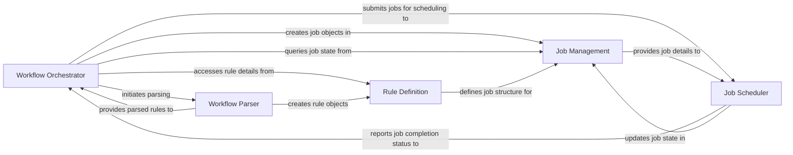

## Details

The `Core Workflow Engine` in Snakemake is the central nervous system, orchestrating the entire workflow execution. It interprets the workflow definition, builds and manages the job dependency graph, and intelligently schedules jobs for execution. This component is fundamental to Snakemake's operation, embodying the core logic of workflow execution and state management.

### Workflow Orchestrator

The central orchestrator, responsible for loading the workflow, constructing and managing the Directed Acyclic Graph (DAG) of jobs (as it inherits from `DAG`), and coordinating the scheduling and execution of jobs. It acts as the main entry point for workflow execution and state management.

**Related Classes/Methods**:

- <a href="https://github.com/snakemake/snakemake/blob/main/src/snakemake/workflow.py#L139-L2412" target="_blank" rel="noopener noreferrer">`snakemake.workflow.Workflow` (139:2412)</a>

### Workflow Parser

Interprets the Snakefile (workflow definition), parsing its rules and configurations into an internal, structured representation. It's the initial step in understanding the user's workflow logic.

**Related Classes/Methods**:

- <a href="https://github.com/snakemake/snakemake/blob/main/src/snakemake/parser.py#L1-L1" target="_blank" rel="noopener noreferrer">`snakemake.parser` (1:1)</a>

### Rule Definition

Represents a single, parsed rule from the Snakefile. It encapsulates the rule's inputs, outputs, parameters, and the command or script to be executed. These objects are the fundamental building blocks from which jobs are derived.

**Related Classes/Methods**:

- <a href="https://github.com/snakemake/snakemake/blob/main/src/snakemake/rules.py#L74-L1331" target="_blank" rel="noopener noreferrer">`snakemake.rules.Rule` (74:1331)</a>

### Job Management

Defines and manages individual job objects. Each job represents a specific task derived from a rule, encapsulating its execution state, dependencies, and resource requirements. It tracks the lifecycle of a job.

**Related Classes/Methods**:

- <a href="https://github.com/snakemake/snakemake/blob/main/src/snakemake/jobs.py#L177-L1299" target="_blank" rel="noopener noreferrer">`snakemake.jobs.Job` (177:1299)</a>

### Job Scheduler

Determines the optimal order in which jobs are executed. It considers job dependencies (from the DAG, managed by the Workflow Orchestrator), available resources, and priorities to dispatch jobs to the execution layer.

**Related Classes/Methods**:

- <a href="https://github.com/snakemake/snakemake/blob/main/src/snakemake/scheduler.py#L54-L852" target="_blank" rel="noopener noreferrer">`snakemake.scheduler.JobScheduler` (54:852)</a>

### [FAQ](https://github.com/CodeBoarding/GeneratedOnBoardings/tree/main?tab=readme-ov-file#faq)