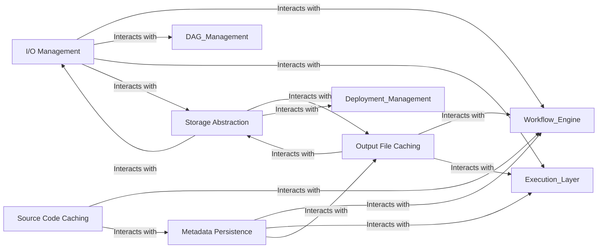

## Details

The `Data Management` component in Snakemake is a critical layer that ensures robust, reproducible, and efficient handling of all data-related operations within scientific workflows. It abstracts the complexities of file I/O, path resolution, metadata tracking, and various storage backends, providing a unified and reliable interface for the workflow engine.

### I/O Management

This component is the primary interface for all file input and output operations. It handles the resolution of file paths, manages special file types (e.g., input, output, log, parameters, resources, wildcards), and provides mechanisms for checking file existence and managing I/O caches. It ensures that the workflow can correctly locate and interact with data files, regardless of their dynamic nature (e.g., wildcards in paths).

**Related Classes/Methods**:

- `snakemake.io.AnnotatedString`

- `snakemake.io.InputFiles`

- `snakemake.io.OutputFiles`

- `snakemake.io.Log`

- `snakemake.io.Params`

- `snakemake.io.Resources`

- `snakemake.io.Wildcards`

- `snakemake.io.IOCache`

- `snakemake.io.ExistsDict`

- <a href="https://github.com/snakemake/snakemake/blob/main/src/snakemake/common/prefix_lookup.py#L7-L55" target="_blank" rel="noopener noreferrer">`snakemake.common.prefix_lookup.PrefixLookup` (7:55)</a>

### Metadata Persistence

This component is responsible for persistently storing crucial workflow metadata, including job execution records, file hashes, and provenance information. This persistence is vital for enabling workflow resumption after interruptions, tracking changes, and ensuring the reproducibility of results by maintaining a historical record of data states and transformations.

**Related Classes/Methods**:

- <a href="https://github.com/snakemake/snakemake/blob/main/src/snakemake/persistence.py#L38-L775" target="_blank" rel="noopener noreferrer">`snakemake.persistence.Persistence` (38:775)</a>

### Source Code Caching

This component manages the caching of source code files, whether they originate from local paths or remote repositories (like GitHub or GitLab). By caching the exact code used for each rule, it guarantees that workflow steps are executed with the intended logic, contributing significantly to the reproducibility and integrity of scientific results.

**Related Classes/Methods**:

- <a href="https://github.com/snakemake/snakemake/blob/main/src/snakemake/sourcecache.py#L347-L466" target="_blank" rel="noopener noreferrer">`snakemake.sourcecache.SourceCache` (347:466)</a>

- <a href="https://github.com/snakemake/snakemake/blob/main/src/snakemake/sourcecache.py#L103-L133" target="_blank" rel="noopener noreferrer">`snakemake.sourcecache.LocalSourceFile` (103:133)</a>

- <a href="https://github.com/snakemake/snakemake/blob/main/src/snakemake/sourcecache.py#L280-L292" target="_blank" rel="noopener noreferrer">`snakemake.sourcecache.GithubFile` (280:292)</a>

- <a href="https://github.com/snakemake/snakemake/blob/main/src/snakemake/sourcecache.py#L295-L311" target="_blank" rel="noopener noreferrer">`snakemake.sourcecache.GitlabFile` (295:311)</a>

- <a href="https://github.com/snakemake/snakemake/blob/main/src/snakemake/sourcecache.py#L186-L277" target="_blank" rel="noopener noreferrer">`snakemake.sourcecache.HostingProviderFile` (186:277)</a>

### Output File Caching

This component handles the caching of output files and their associated provenance hashes. Its primary goal is to optimize workflow execution by preventing the re-execution of rules whose inputs and code have not changed, thereby saving computational resources and time. It implements strategies for efficient storage and retrieval of cached outputs.

**Related Classes/Methods**:

- <a href="https://github.com/snakemake/snakemake/blob/main/src/snakemake/caching/local.py#L17-L170" target="_blank" rel="noopener noreferrer">`snakemake.caching.local.OutputFileCache` (17:170)</a>

- <a href="https://github.com/snakemake/snakemake/blob/main/src/snakemake/caching/storage.py#L14-L69" target="_blank" rel="noopener noreferrer">`snakemake.caching.storage.OutputFileCache` (14:69)</a>

- <a href="https://github.com/snakemake/snakemake/blob/main/src/snakemake/caching/hash.py#L19-L147" target="_blank" rel="noopener noreferrer">`snakemake.caching.hash.ProvenanceHashMap` (19:147)</a>

### Storage Abstraction

This component provides a unified and extensible interface for interacting with various data storage backends. It supports local file systems as well as diverse cloud storage services (e.g., Amazon S3, Azure Blob Storage, Google Cloud Storage). This abstraction layer decouples the workflow logic from the underlying storage infrastructure, enabling seamless data access and portability across different environments.

**Related Classes/Methods**:

- <a href="https://github.com/snakemake/snakemake/blob/main/src/snakemake/storage.py#L23-L208" target="_blank" rel="noopener noreferrer">`snakemake.storage.StorageRegistry` (23:208)</a>

- <a href="https://github.com/snakemake/snakemake/blob/main/src/snakemake/storage.py#L211-L224" target="_blank" rel="noopener noreferrer">`snakemake.storage.StorageProviderProxy` (211:224)</a>

- <a href="https://github.com/snakemake/snakemake/blob/main/src/snakemake/remote/S3.py" target="_blank" rel="noopener noreferrer">`snakemake.remote.S3`</a>

- <a href="https://github.com/snakemake/snakemake/blob/main/src/snakemake/remote/AzBlob.py" target="_blank" rel="noopener noreferrer">`snakemake.remote.AzBlob`</a>

- `snakemake.remote.GoogleCloudStorage`

### [FAQ](https://github.com/CodeBoarding/GeneratedOnBoardings/tree/main?tab=readme-ov-file#faq)