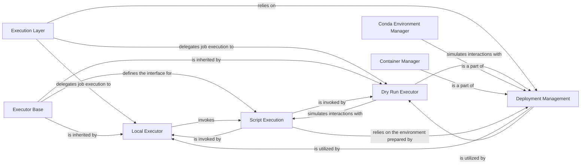

## Details

The Execution Layer in Snakemake is a critical subsystem responsible for the actual running of workflow jobs and managing their required software environments. It embodies the Strategy Pattern, allowing Snakemake to adapt to various execution backends (local, dry run, cluster, cloud) and ensures reproducibility through robust environment management.

### Execution Layer [[Expand]](./Execution_Layer.md)

This is the top-level conceptual component that orchestrates the execution of jobs. It acts as a facade, providing a unified interface for the core workflow engine to initiate job execution, abstracting away the complexities of different execution strategies and environment provisioning.

**Related Classes/Methods**:

- `snakemake.executors.Executor`

### Executor Base

This abstract base class defines the common interface and core logic for all job executors. It establishes the contract for how jobs are handled, including methods for submitting, monitoring, and finalizing jobs. This is where the Strategy Pattern is implemented, with concrete subclasses providing specific execution strategies.

**Related Classes/Methods**:

- `snakemake.executors.Executor`

### Local Executor

A concrete implementation of the `Executor` base class, responsible for executing jobs directly on the local machine where Snakemake is running. It handles the spawning of local processes and managing their lifecycle.

**Related Classes/Methods**:

- `snakemake.executors.LocalExecutor`

### Dry Run Executor

Another concrete `Executor` implementation that simulates the execution of a workflow without actually running any commands or creating output files. It's crucial for validating workflow logic, dependency resolution, and identifying potential issues before actual execution.

**Related Classes/Methods**:

- `snakemake.executors.DryrunExecutor`

### Deployment Management

This component is responsible for provisioning and managing the software environments (e.g., Conda, Singularity/Docker containers) required for each job. It ensures that jobs run in isolated and reproducible environments, handling environment creation, activation, and caching.

**Related Classes/Methods**:

- `snakemake.deployment`

- <a href="https://github.com/snakemake/snakemake/blob/main/src/snakemake/deployment/conda.py" target="_blank" rel="noopener noreferrer">`snakemake.deployment.conda`</a>

- <a href="https://github.com/snakemake/snakemake/blob/main/src/snakemake/deployment/singularity.py" target="_blank" rel="noopener noreferrer">`snakemake.deployment.singularity`</a>

### Conda Environment Manager

A specialized part of `Deployment Management` that specifically handles Conda environments. It manages the creation, activation, and caching of Conda environments based on the `conda` directive in Snakemake rules, ensuring that the correct software dependencies are available for each job.

**Related Classes/Methods**:

- <a href="https://github.com/snakemake/snakemake/blob/main/src/snakemake/deployment/conda.py#L686-L857" target="_blank" rel="noopener noreferrer">`snakemake.deployment.conda.Conda` (686:857)</a>

### Container Manager

A specialized part of `Deployment Management` that handles the use of Singularity (and implicitly Docker) containers for job execution. It manages pulling, building, and running jobs within isolated container environments, further enhancing reproducibility and portability across different systems.

**Related Classes/Methods**:

- <a href="https://github.com/snakemake/snakemake/blob/main/src/snakemake/deployment/singularity.py#L155-L220" target="_blank" rel="noopener noreferrer">`snakemake.deployment.singularity.Singularity` (155:220)</a>

### Script Execution

This component, along with its subclasses (e.g., `BashScript`, `PythonScript`, `RScript`), is responsible for executing the actual user-defined scripts or shell commands specified within a Snakemake rule. It provides the necessary environment and context for these scripts to run correctly within the job's allocated resources and prepared environment.

**Related Classes/Methods**:

- `snakemake.script.ScriptBase`

### [FAQ](https://github.com/CodeBoarding/GeneratedOnBoardings/tree/main?tab=readme-ov-file#faq)