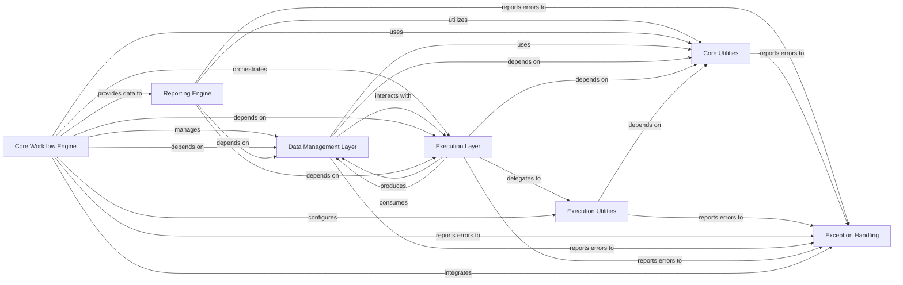

## Details

The previous analysis contained inaccuracies regarding source code references and omitted definitions for key abstract components. This revised analysis addresses these points by correcting the component mappings and introducing the missing architectural layers, providing a more complete and accurate overview of the Snakemake subsystem.

### Core Workflow Engine [[Expand]](./Core_Workflow_Engine.md)

This is the central orchestrator of Snakemake workflows. It is responsible for parsing Snakefiles, constructing the Directed Acyclic Graph (DAG) of jobs, scheduling job execution, and managing the overall flow of the workflow. It interacts with other components to manage data, execute tasks, and handle exceptions.

**Related Classes/Methods**:

- <a href="https://github.com/snakemake/snakemake/blob/main/src/snakemake/workflow.py#L139-L2412" target="_blank" rel="noopener noreferrer">`snakemake.workflow.Workflow` (139:2412)</a>

- <a href="https://github.com/snakemake/snakemake/blob/main/src/snakemake/dag.py#L103-L3300" target="_blank" rel="noopener noreferrer">`snakemake.dag.DAG` (103:3300)</a>

- <a href="https://github.com/snakemake/snakemake/blob/main/src/snakemake/scheduler.py#L54-L852" target="_blank" rel="noopener noreferrer">`snakemake.scheduler.JobScheduler` (54:852)</a>

- <a href="https://github.com/snakemake/snakemake/blob/main/src/snakemake/rules.py#L74-L1331" target="_blank" rel="noopener noreferrer">`snakemake.rules.Rule` (74:1331)</a>

### Data Management Layer

This component handles all aspects of data interaction within Snakemake. It manages input and output files, handles temporary and protected files, interacts with various storage backends (local, remote, cloud), and provides mechanisms for caching and provenance tracking.

**Related Classes/Methods**:

- `snakemake.io.IOFile` (1:1)

- `snakemake.io.Namedlist` (1:1)

- `snakemake.io.AnnotatedString` (1:1)

- <a href="https://github.com/snakemake/snakemake/blob/main/src/snakemake/caching/local.py#L17-L170" target="_blank" rel="noopener noreferrer">`snakemake.caching.local.OutputFileCache` (17:170)</a>

- <a href="https://github.com/snakemake/snakemake/blob/main/src/snakemake/storage.py#L23-L208" target="_blank" rel="noopener noreferrer">`snakemake.storage.StorageRegistry` (23:208)</a>

- <a href="https://github.com/snakemake/snakemake/blob/main/src/snakemake/persistence.py#L38-L775" target="_blank" rel="noopener noreferrer">`snakemake.persistence.Persistence` (38:775)</a>

### Execution Layer [[Expand]](./Execution_Layer.md)

This component is responsible for the actual execution of commands, scripts, and notebooks defined in Snakemake rules. It provides interfaces for different execution environments, including local shell execution, containerization (Conda, Singularity), and integration with external systems.

**Related Classes/Methods**:

- <a href="https://github.com/snakemake/snakemake/blob/main/src/snakemake/executors/local.py#L1-L1" target="_blank" rel="noopener noreferrer">`snakemake.executors.local.LocalExecutor` (1:1)</a>

- <a href="https://github.com/snakemake/snakemake/blob/main/src/snakemake/shell.py#L42-L368" target="_blank" rel="noopener noreferrer">`snakemake.shell.shell` (42:368)</a>

- `snakemake.script.ScriptBase` (1:1)

- <a href="https://github.com/snakemake/snakemake/blob/main/src/snakemake/deployment/conda.py#L686-L857" target="_blank" rel="noopener noreferrer">`snakemake.deployment.conda.Conda` (686:857)</a>

- <a href="https://github.com/snakemake/snakemake/blob/main/src/snakemake/deployment/singularity.py#L155-L220" target="_blank" rel="noopener noreferrer">`snakemake.deployment.singularity.Singularity` (155:220)</a>

### Reporting Engine

This component is dedicated to generating comprehensive and detailed reports of workflow execution. It includes functionalities for creating job summaries, provenance information, and performance benchmarks. It aggregates data from various stages of the workflow to provide insights into execution, aiding in monitoring and reproducibility.

**Related Classes/Methods**:

- <a href="https://github.com/snakemake/snakemake/blob/main/src/snakemake/report/html_reporter/common.py#L1-L1" target="_blank" rel="noopener noreferrer">`snakemake.report.html_reporter.common.html_report` (1:1)</a>

- <a href="https://github.com/snakemake/snakemake/blob/main/src/snakemake/benchmark.py#L289-L402" target="_blank" rel="noopener noreferrer">`snakemake.benchmark.BenchmarkTimer` (289:402)</a>

- <a href="https://github.com/snakemake/snakemake/blob/main/src/snakemake/benchmark.py#L223-L242" target="_blank" rel="noopener noreferrer">`snakemake.benchmark.DaemonTimer` (223:242)</a>

### Core Utilities

This component provides a foundational collection of general-purpose helper functions, common data structures, and low-level utilities. These utilities are used across various other components of the Snakemake system, including string formatting, path manipulation, and common data handling.

**Related Classes/Methods**:

- <a href="https://github.com/snakemake/snakemake/blob/main/src/snakemake/utils.py#L430-L462" target="_blank" rel="noopener noreferrer">`snakemake.utils.QuotedFormatter` (430:462)</a>

- <a href="https://github.com/snakemake/snakemake/blob/main/src/snakemake/common/prefix_lookup.py#L7-L55" target="_blank" rel="noopener noreferrer">`snakemake.common.prefix_lookup.PrefixLookup` (7:55)</a>

- `snakemake.io.Namedlist` (1:1)

- `snakemake.io.AnnotatedString` (1:1)

### Execution Utilities

This component handles the execution of external commands and scripts, providing a standardized interface for Snakemake to interact with the underlying operating system and execute user-defined logic. This includes shell commands, Python scripts, and other supported scripting languages.

**Related Classes/Methods**:

- <a href="https://github.com/snakemake/snakemake/blob/main/src/snakemake/parser.py#L647-L652" target="_blank" rel="noopener noreferrer">`snakemake.parser.Shell` (647:652)</a>

- `snakemake.script.ScriptBase` (1:1)

- <a href="https://github.com/snakemake/snakemake/blob/main/src/snakemake/parser.py#L582-L644" target="_blank" rel="noopener noreferrer">`snakemake.parser.AbstractCmd` (582:644)</a>

### Exception Handling

This component provides a centralized and structured mechanism for managing and reporting errors and exceptions that occur during workflow execution. It defines a hierarchy of custom exceptions to ensure robust error handling and provide informative feedback to the user.

**Related Classes/Methods**:

- <a href="https://github.com/snakemake/snakemake/blob/main/src/snakemake/exceptions.py#L207-L245" target="_blank" rel="noopener noreferrer">`snakemake.exceptions.RuleException` (207:245)</a>

### [FAQ](https://github.com/CodeBoarding/GeneratedOnBoardings/tree/main?tab=readme-ov-file#faq)