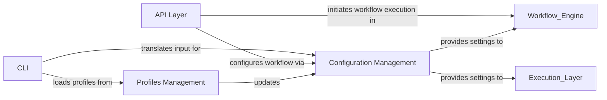

## Details

One paragraph explaining the functionality which is represented by this graph. What the main flow is and what is its purpose.

### CLI

The `CLI` component is the primary entry point for users to interact with Snakemake via the command line. It is responsible for parsing and validating command-line arguments, translating them into structured configurations, and orchestrating the initial setup and execution flow of the workflow. It acts as the "command" part of the CQRS pattern, interpreting user directives.

**Related Classes/Methods**:

- <a href="https://github.com/snakemake/snakemake/blob/main/src/snakemake/cli.py#L1-L1" target="_blank" rel="noopener noreferrer">`snakemake.cli` (1:1)</a>

### API Layer

The `API Layer` offers a comprehensive programmatic interface for defining, configuring, and executing Snakemake workflows. It acts as a **Facade Pattern** for the entire system, abstracting the complex internal logic of the workflow engine and configuration management. This layer enables other tools or scripts to integrate with and control Snakemake programmatically, serving as the "query" part of the CQRS pattern.

**Related Classes/Methods**:

- <a href="https://github.com/snakemake/snakemake/blob/main/src/snakemake/api.py#L90-L289" target="_blank" rel="noopener noreferrer">`snakemake.api.SnakemakeApi` (90:289)</a>

- <a href="https://github.com/snakemake/snakemake/blob/main/src/snakemake/api.py#L303-L426" target="_blank" rel="noopener noreferrer">`snakemake.api.WorkflowApi` (303:426)</a>

- <a href="https://github.com/snakemake/snakemake/blob/main/src/snakemake/api.py#L430-L779" target="_blank" rel="noopener noreferrer">`snakemake.api.DAGApi` (430:779)</a>

### Configuration Management

This component centralizes the definition, validation, and management of all configurable parameters within Snakemake. It encompasses various settings related to workflow execution, resource allocation, deployment, and data storage. It ensures that all configurations are properly structured and validated, providing a single, consistent source of truth for workflow behavior. Key classes like `SettingsBase` and its derivatives (`ConfigSettings`, `DAGSettings`, `DeploymentSettings`, `ExecutionSettings`, `ResourceSettings`, `StorageSettings`, `WorkflowSettings`) are integral here.

**Related Classes/Methods**:

- <a href="https://github.com/snakemake/snakemake/blob/main/src/snakemake/settings/types.py#L45-L52" target="_blank" rel="noopener noreferrer">`snakemake.settings.types.SettingsBase` (45:52)</a>

- <a href="https://github.com/snakemake/snakemake/blob/main/src/snakemake/settings/types.py#L361-L388" target="_blank" rel="noopener noreferrer">`snakemake.settings.types.ConfigSettings` (361:388)</a>

- <a href="https://github.com/snakemake/snakemake/blob/main/src/snakemake/settings/types.py#L196-L223" target="_blank" rel="noopener noreferrer">`snakemake.settings.types.DAGSettings` (196:223)</a>

- <a href="https://github.com/snakemake/snakemake/blob/main/src/snakemake/settings/types.py#L246-L293" target="_blank" rel="noopener noreferrer">`snakemake.settings.types.DeploymentSettings` (246:293)</a>

- <a href="https://github.com/snakemake/snakemake/blob/main/src/snakemake/settings/types.py#L90-L124" target="_blank" rel="noopener noreferrer">`snakemake.settings.types.ExecutionSettings` (90:124)</a>

- <a href="https://github.com/snakemake/snakemake/blob/main/src/snakemake/settings/types.py#L343-L357" target="_blank" rel="noopener noreferrer">`snakemake.settings.types.ResourceSettings` (343:357)</a>

- <a href="https://github.com/snakemake/snakemake/blob/main/src/snakemake/settings/types.py#L227-L242" target="_blank" rel="noopener noreferrer">`snakemake.settings.types.StorageSettings` (227:242)</a>

- <a href="https://github.com/snakemake/snakemake/blob/main/src/snakemake/settings/types.py#L128-L134" target="_blank" rel="noopener noreferrer">`snakemake.settings.types.WorkflowSettings` (128:134)</a>

### Profiles Management

The `Profiles Management` component handles the loading and application of predefined execution profiles. These profiles are collections of configurations tailored for specific computational environments (e.g., local machines, HPC clusters, cloud platforms). It simplifies complex setup procedures for users by allowing them to switch between different execution contexts with ease.

**Related Classes/Methods**:

- <a href="https://github.com/snakemake/snakemake/blob/main/src/snakemake/profiles.py#L1-L1" target="_blank" rel="noopener noreferrer">`snakemake.profiles` (1:1)</a>

### [FAQ](https://github.com/CodeBoarding/GeneratedOnBoardings/tree/main?tab=readme-ov-file#faq)