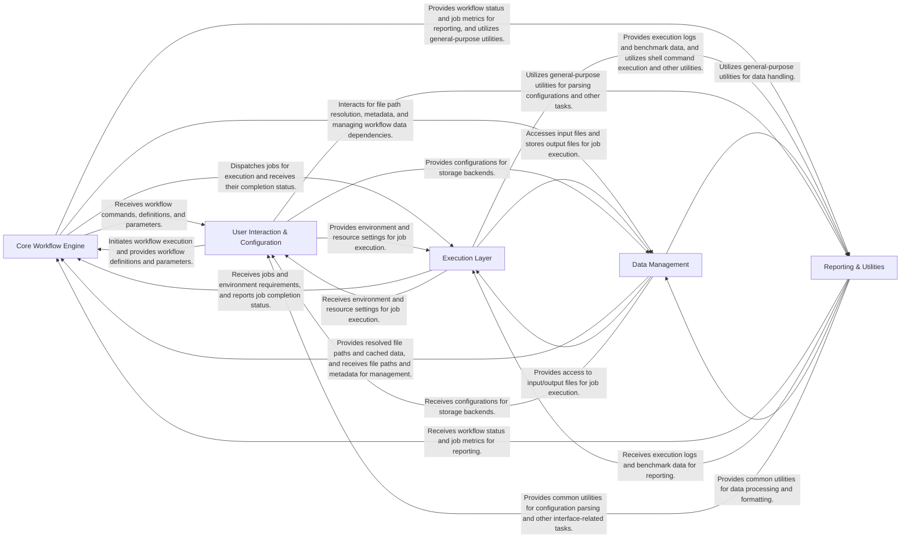

## Details

Snakemake High-Level Architecture Overview: Scientific Workflow Management System (WMS) with Pipeline/Workflow Pattern, Plugin Architecture, Interpreter Pattern, Command-Query Responsibility Segregation (CQRS), State Machine, Facade Pattern, Strategy Pattern, Dependency Graph.

### Core Workflow Engine [[Expand]](./Core_Workflow_Engine.md)

The central orchestrator of Snakemake, responsible for interpreting workflow definitions, constructing and managing the Directed Acyclic Graph (DAG) of jobs, and scheduling jobs for execution based on dependencies and resource availability. This component embodies the core logic of workflow execution and state management.

**Related Classes/Methods**:

- <a href="https://github.com/snakemake/snakemake/blob/main/src/snakemake/workflow.py#L1-L1" target="_blank" rel="noopener noreferrer">`snakemake.workflow` (1:1)</a>

- <a href="https://github.com/snakemake/snakemake/blob/main/src/snakemake/dag.py#L1-L1" target="_blank" rel="noopener noreferrer">`snakemake.dag` (1:1)</a>

- <a href="https://github.com/snakemake/snakemake/blob/main/src/snakemake/jobs.py#L1-L1" target="_blank" rel="noopener noreferrer">`snakemake.jobs` (1:1)</a>

- <a href="https://github.com/snakemake/snakemake/blob/main/src/snakemake/scheduler.py#L1-L1" target="_blank" rel="noopener noreferrer">`snakemake.scheduler` (1:1)</a>

- <a href="https://github.com/snakemake/snakemake/blob/main/src/snakemake/parser.py#L1-L1" target="_blank" rel="noopener noreferrer">`snakemake.parser` (1:1)</a>

### Execution Layer [[Expand]](./Execution_Layer.md)

Manages the actual execution of individual jobs and the provisioning of their required software environments. It handles various execution modes (e.g., local, dry run) and ensures reproducibility by managing containerized (Singularity/Docker) or Conda environments.

**Related Classes/Methods**:

- `snakemake.executors` (1:1)

- <a href="https://github.com/snakemake/snakemake/blob/main/src/snakemake/deployment/conda.py#L1-L1" target="_blank" rel="noopener noreferrer">`snakemake.deployment.conda` (1:1)</a>

- <a href="https://github.com/snakemake/snakemake/blob/main/src/snakemake/deployment/singularity.py#L1-L1" target="_blank" rel="noopener noreferrer">`snakemake.deployment.singularity` (1:1)</a>

- `snakemake.script` (1:1)

### Data Management [[Expand]](./Data_Management.md)

Provides comprehensive management for all data-related operations, including file I/O, path resolution, metadata persistence, and efficient caching of source code and output files. It abstracts various storage backends (e.g., local, cloud storage).

**Related Classes/Methods**:

- `snakemake.io` (1:1)

- <a href="https://github.com/snakemake/snakemake/blob/main/src/snakemake/persistence.py#L1-L1" target="_blank" rel="noopener noreferrer">`snakemake.persistence` (1:1)</a>

- <a href="https://github.com/snakemake/snakemake/blob/main/src/snakemake/sourcecache.py#L1-L1" target="_blank" rel="noopener noreferrer">`snakemake.sourcecache` (1:1)</a>

- `snakemake.caching` (1:1)

- <a href="https://github.com/snakemake/snakemake/blob/main/src/snakemake/storage.py#L1-L1" target="_blank" rel="noopener noreferrer">`snakemake.storage` (1:1)</a>

### User Interaction & Configuration [[Expand]](./User_Interaction_Configuration.md)

Serves as the primary interface for users and external tools to interact with Snakemake. It handles command-line argument parsing, initiates workflow runs, and provides a programmatic API. This component also centralizes the management of all configurable parameters, including resource allocations, deployment options, and execution profiles.

**Related Classes/Methods**:

- <a href="https://github.com/snakemake/snakemake/blob/main/src/snakemake/cli.py#L1-L1" target="_blank" rel="noopener noreferrer">`snakemake.cli` (1:1)</a>

- <a href="https://github.com/snakemake/snakemake/blob/main/src/snakemake/api.py#L1-L1" target="_blank" rel="noopener noreferrer">`snakemake.api` (1:1)</a>

- <a href="https://github.com/snakemake/snakemake/blob/main/src/snakemake/settings/types.py#L1-L1" target="_blank" rel="noopener noreferrer">`snakemake.settings.types` (1:1)</a>

- <a href="https://github.com/snakemake/snakemake/blob/main/src/snakemake/profiles.py#L1-L1" target="_blank" rel="noopener noreferrer">`snakemake.profiles` (1:1)</a>

### Reporting & Utilities [[Expand]](./Reporting_Utilities.md)

Responsible for generating comprehensive reports of workflow execution, including provenance information, job summaries, and performance benchmarks. It also provides a collection of general-purpose helper functions, common data structures, and low-level utilities (e.g., shell command execution) used across various components of the system.

**Related Classes/Methods**:

- `snakemake.report` (1:1)

- <a href="https://github.com/snakemake/snakemake/blob/main/src/snakemake/benchmark.py#L1-L1" target="_blank" rel="noopener noreferrer">`snakemake.benchmark` (1:1)</a>

- <a href="https://github.com/snakemake/snakemake/blob/main/src/snakemake/utils.py#L1-L1" target="_blank" rel="noopener noreferrer">`snakemake.utils` (1:1)</a>

- `snakemake.common` (1:1)

### [FAQ](https://github.com/CodeBoarding/GeneratedOnBoardings/tree/main?tab=readme-ov-file#faq)