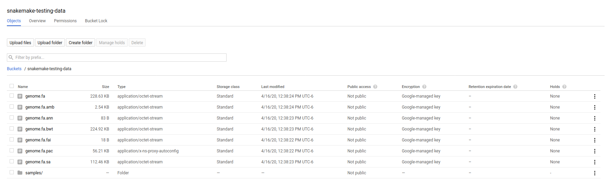
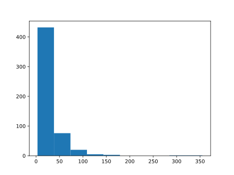
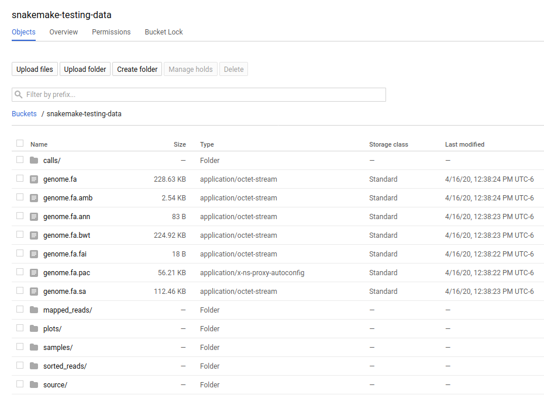

.. _tutorial-google-lifesciences:

Google Life Sciences Tutorial
------------------------------

.. _Snakemake: http://snakemake.readthedocs.io
.. _Snakemake Remotes: https://snakemake.readthedocs.io/en/stable/snakefiles/remote_files.html
.. _Python: https://www.python.org/

Setup
:::::

To go through this tutorial, you need the following software installed:

* Python_ ≥3.5
* Snakemake_ ≥5.16
* git

First, you have to install the Miniconda Python3 distribution.
See `here <https://conda.io/en/latest/miniconda.html>`_ for installation instructions.
Make sure to ...

* Install the **Python 3** version of Miniconda.
* Answer yes to the question whether conda shall be put into your PATH.

The default conda solver is a bit slow and sometimes has issues with `selecting the latest package releases <https://github.com/conda/conda/issues/9905>`_. Therefore, we recommend to install `Mamba <https://github.com/QuantStack/mamba>`_ as a drop-in replacement via

.. code-block:: console

    $ conda install -c conda-forge mamba

Then, you can install Snakemake with

.. code-block:: console

    $ mamba create -c conda-forge -c bioconda -n snakemake snakemake

from the `Bioconda <https://bioconda.github.io>`_ channel.
This will install snakemake into an isolated software environment, that has to be activated with

.. code-block:: console

    $ conda activate snakemake
    $ snakemake --help

Credentials
:::::::::::

Using the Google Life Sciences executor with Snakemake requires the environment 
variable `GOOGLE_APPLICATION_CREDENTIALS` exported, which should point to
the full path of the file on your local machine. To generate this file, you
can refer to the page under iam-admin to `download your service account <https://console.cloud.google.com/iam-admin/iam>`_ key and export it to the environment.

.. code:: console

    export GOOGLE_APPLICATION_CREDENTIALS="/home/[username]/credentials.json"

The suggested, minimal permissions required for this role include the following:

 - Compute Storage Admin(Can potentially be restricted further)
 - Compute Viewer
 - Service Account User
 - Cloud Life Sciences Workflows Runner
 - Service Usage Consumer

Step 1: Upload Your Data
::::::::::::::::::::::::

We will be obtaining inputs from Google Cloud Storage, as well as saving
outputs there. You should first clone the repository with the Snakemake tutorial data:

.. code:: console

    git clone https://github.com/snakemake/snakemake-tutorial-data
    cd snakemake-tutorial-data

And then either manually create a bucket and upload data files there, or
use the `provided script and instructions <https://github.com/snakemake/snakemake-tutorial-data#google-cloud-storage>`_
to do it programatically from the command line. The script generally works like:

.. code:: console

    python upload_google_storage.py <bucket>/<subpath>   <folder>

And you aren't required to provide a subfolder path if you want to upload
to the root of a bucket. As an example, for this tutorial we upload the contents of
"data" to the root of the bucket `snakemake-testing-data`

.. code:: console

    export GOOGLE_APPLICATION_CREDENTIALS="/path/to/credentials.json"
    python upload_google_storage.py snakemake-testing-data data/

If you wanted to upload to a "subfolder" path in a bucket, you would do that as follows:

.. code:: console

    export GOOGLE_APPLICATION_CREDENTIALS="/path/to/credentials.json"
    python upload_google_storage.py snakemake-testing-data/subfolder data/

Your bucket (and the folder prefix) will be referred to as the
`--default-remote-prefix` when you run snakemake. You can visually
browse your data in the `storage browser <https://console.cloud.google.com/storage/>_`.

Step 2: Write your Snakefile, Environment File, and Scripts
:::::::::::::::::::::::::::::::::::::::::::::::::::::::::::

Now that we've exported our credentials and have all dependencies installed, let's
get our workflow! This is the exact same workflow from the :ref:`basic tutorial<tutorial-basics>`,
so if you need a refresher on the design or basics, please see those pages.
You can find the Snakefile, supporting scripts for plotting and environment in the
 `snakemake-tutorial-data <https://github.com/snakemake/snakemake-tutorial-data>`_
repository.

First, how does a working directory work for this executor? The present
working directory, as identified by Snakemake that has the Snakefile, and where
a more advanced setup might have a folder of environment specifications (env) a folder of scripts 
(scripts), and rules (rules), is considered within the context of the build.
When the Google Life Sciences executor is used, it generates a build package of all
of the files here (within a reasonable size) and uploads those to storage. This
package includes the .snakemake folder that would have been generated locally.
The build package is then downloaded and extracted by each cloud executor, which
is a Google Compute instance.

We next need an `environment.yaml` file that will define the dependencies
that we want installed with conda for our job. If you cloned the "snakemake-tutorial-data"
repository you will already have this, and you are good to go. If not, save this to `environment.yaml`
in your working directory:

.. code:: yaml

    channels:
      - conda-forge
      - bioconda
    dependencies:
      - python =3.6
      - jinja2 =2.10
      - networkx =2.1
      - matplotlib =2.2.3
      - graphviz =2.38.0
      - bcftools =1.9
      - samtools =1.9
      - bwa =0.7.17
      - pysam =0.15.0
    

Notice that we reference this `environment.yaml` file in the Snakefile below.
Importantly, if you were optimizing a pipeline, you would likely have a folder
"envs" with more than one environment specification, one for each step.
This workflow uses the same environment (with many dependencies) instead of
this strategy to minimize the number of files for you.

The Snakefile (also included in the repository) then has the following content. It's important to note
that we have not customized this file from the basic tutorial to hard code 
any storage. We will be telling snakemake to use the remote bucket as 
storage instead of the local filesystem.

.. code:: python

    SAMPLES = ["A", "B"]

    rule all:
        input:
            "plots/quals.svg"

    rule bwa_map:
        input:
            fastq="samples/{sample}.fastq",
            idx=multiext("genome.fa", ".amb", ".ann", ".bwt", ".pac", ".sa")
        conda:
            "environment.yaml"
        output:
            "mapped_reads/{sample}.bam"
        params:
            idx=lambda w, input: os.path.splitext(input.idx[0])[0]
        shell:
            "bwa mem {params.idx} {input.fastq} | samtools view -Sb - > {output}"

    rule samtools_sort:
        input:
            "mapped_reads/{sample}.bam"
        output:
            "sorted_reads/{sample}.bam"
        conda:
            "environment.yaml"
        shell:
            "samtools sort -T sorted_reads/{wildcards.sample} "
            "-O bam {input} > {output}"

    rule samtools_index:
        input:
            "sorted_reads/{sample}.bam"
        output:
            "sorted_reads/{sample}.bam.bai"
        conda:
            "environment.yaml"
        shell:
            "samtools index {input}"

    rule bcftools_call:
        input:
            fa="genome.fa",
            bam=expand("sorted_reads/{sample}.bam", sample=SAMPLES),
            bai=expand("sorted_reads/{sample}.bam.bai", sample=SAMPLES)
        output:
            "calls/all.vcf"
        conda:
            "environment.yaml"
        shell:
            "samtools mpileup -g -f {input.fa} {input.bam} | "
            "bcftools call -mv - > {output}"

    rule plot_quals:
        input:
            "calls/all.vcf"
        output:
            "plots/quals.svg"
        conda:
            "environment.yaml"
        script:
            "plot-quals.py"

And make sure you also have the script `plot-quals.py` in your present working directory for the last step.
This script will help us to do the plotting, and is also included in the 
 `snakemake-tutorial-data <https://github.com/snakemake/snakemake-tutorial-data>`_
repository.

.. code:: python

    import matplotlib

    matplotlib.use("Agg")
    import matplotlib.pyplot as plt
    from pysam import VariantFile

    quals = [record.qual for record in VariantFile(snakemake.input[0])]
    plt.hist(quals)

    plt.savefig(snakemake.output[0])

Step 3: Run Snakemake
:::::::::::::::::::::

Now let's run Snakemake with the Google Life Sciences Executor.

.. code:: console

    snakemake --google-lifesciences --default-remote-prefix snakemake-testing-data --use-conda --google-lifesciences-region us-west1

The flags above refer to:

 - `--google-lifesciences`: to indicate that we want to use the Google Life Sciences API
 - `--default-remote-prefix`: refers to the Google Storage bucket. The bucket name is "snakemake-testing-data" and the "subfolder" (or path) (not defined above) would be a subfolder, if needed.
 - `--google-lifesciences-region`: the region that you want the instances to deploy to. Your storage bucket should be accessible from here, and your selection can have a small influence on the machine type selected.

Once you submit the job, you'll immediately see the familiar Snakemake console output,
but with additional lines for inspecting google compute instances with gcloud:

.. code:: console

    Building DAG of jobs...
    Unable to retrieve additional files from git. This is not a git repository.
    Using shell: /bin/bash
    Rules claiming more threads will be scaled down.
    Job counts:
    	count	jobs
    	1	all
    	1	bcftools_call
    	2	bwa_map
	1	plot_quals
	2	samtools_index
	2	samtools_sort
	9

    [Thu Apr 16 19:16:24 2020]
    rule bwa_map:
        input: snakemake-testing-data/genome.fa, snakemake-testing-data/samples/B.fastq
        output: snakemake-testing-data/mapped_reads/B.bam
        jobid: 8
        wildcards: sample=B
        resources: mem_mb=15360, disk_mb=128000

    Get status with:
    gcloud config set project snakemake-testing
    gcloud beta lifesciences operations describe 13586583122112209762
    gcloud beta lifesciences operations list

Take note of those last three lines to describe and list operations - this is how you
get complete error and output logs for the run, which we will demonstrate using later.

And you'll see a block like that for each rule. Here is what the entire workflow looks
like after completion:

.. code:: console

    Building DAG of jobs...
    Unable to retrieve additional files from git. This is not a git repository.
    Using shell: /bin/bash
    Rules claiming more threads will be scaled down.
    Job counts:
    	count	jobs
   	1	all
	1	bcftools_call
	2	bwa_map
	1	plot_quals
	2	samtools_index
	2	samtools_sort
	9

    [Fri Apr 17 20:27:51 2020]
    rule bwa_map:
        input: snakemake-testing-data/samples/B.fastq, snakemake-testing-data/genome.fa.amb, snakemake-testing-data/genome.fa.ann, snakemake-testing-data/genome.fa.bwt, snakemake-testing-data/genome.fa.pac, snakemake-testing-data/genome.fa.sa
        output: snakemake-testing-data/mapped_reads/B.bam
        jobid: 8
        wildcards: sample=B
        resources: mem_mb=15360, disk_mb=128000

    Get status with:
    gcloud config set project snakemake-testing
    gcloud beta lifesciences operations describe projects/snakemake-testing/locations/us-west2/operations/16135317625786219242
    gcloud beta lifesciences operations list
    [Fri Apr 17 20:31:16 2020]
    Finished job 8.
    1 of 9 steps (11%) done

    [Fri Apr 17 20:31:16 2020]
    rule bwa_map:
        input: snakemake-testing-data/samples/A.fastq, snakemake-testing-data/genome.fa.amb, snakemake-testing-data/genome.fa.ann, snakemake-testing-data/genome.fa.bwt, snakemake-testing-data/genome.fa.pac, snakemake-testing-data/genome.fa.sa
        output: snakemake-testing-data/mapped_reads/A.bam
        jobid: 7
        wildcards: sample=A
        resources: mem_mb=15360, disk_mb=128000

    Get status with:
    gcloud config set project snakemake-testing
    gcloud beta lifesciences operations describe projects/snakemake-testing/locations/us-west2/operations/5458247376121133509
    gcloud beta lifesciences operations list
    [Fri Apr 17 20:34:30 2020]
    Finished job 7.
    2 of 9 steps (22%) done

    [Fri Apr 17 20:34:30 2020]
    rule samtools_sort:
        input: snakemake-testing-data/mapped_reads/B.bam
        output: snakemake-testing-data/sorted_reads/B.bam
        jobid: 4
        wildcards: sample=B
        resources: mem_mb=15360, disk_mb=128000

    Get status with:
    gcloud config set project snakemake-testing
    gcloud beta lifesciences operations describe projects/snakemake-testing/locations/us-west2/operations/13750029425473765929
    gcloud beta lifesciences operations list
    [Fri Apr 17 20:37:34 2020]
    Finished job 4.
    3 of 9 steps (33%) done

    [Fri Apr 17 20:37:35 2020]
    rule samtools_sort:
        input: snakemake-testing-data/mapped_reads/A.bam
        output: snakemake-testing-data/sorted_reads/A.bam
        jobid: 3
        wildcards: sample=A
        resources: mem_mb=15360, disk_mb=128000

    Get status with:
    gcloud config set project snakemake-testing
    gcloud beta lifesciences operations describe projects/snakemake-testing/locations/us-west2/operations/15643873965497084056
    gcloud beta lifesciences operations list
    [Fri Apr 17 20:40:37 2020]
    Finished job 3.
    4 of 9 steps (44%) done

    [Fri Apr 17 20:40:38 2020]
    rule samtools_index:
        input: snakemake-testing-data/sorted_reads/B.bam
        output: snakemake-testing-data/sorted_reads/B.bam.bai
        jobid: 6
        wildcards: sample=B
        resources: mem_mb=15360, disk_mb=128000

    Get status with:
    gcloud config set project snakemake-testing
    gcloud beta lifesciences operations describe projects/snakemake-testing/locations/us-west2/operations/6525320566174651173
    gcloud beta lifesciences operations list
    [Fri Apr 17 20:43:41 2020]
    Finished job 6.
    5 of 9 steps (56%) done

    [Fri Apr 17 20:43:41 2020]
    rule samtools_index:
        input: snakemake-testing-data/sorted_reads/A.bam
        output: snakemake-testing-data/sorted_reads/A.bam.bai
        jobid: 5
        wildcards: sample=A
        resources: mem_mb=15360, disk_mb=128000

    Get status with:
    gcloud config set project snakemake-testing
    gcloud beta lifesciences operations describe projects/snakemake-testing/locations/us-west2/operations/9175497885319251567
    gcloud beta lifesciences operations list
    [Fri Apr 17 20:46:44 2020]
    Finished job 5.
    6 of 9 steps (67%) done

    [Fri Apr 17 20:46:44 2020]
    rule bcftools_call:
        input: snakemake-testing-data/genome.fa, snakemake-testing-data/sorted_reads/A.bam, snakemake-testing-data/sorted_reads/B.bam, snakemake-testing-data/sorted_reads/A.bam.bai, snakemake-testing-data/sorted_reads/B.bam.bai
        output: snakemake-testing-data/calls/all.vcf
        jobid: 2
        resources: mem_mb=15360, disk_mb=128000

    Get status with:
    gcloud config set project snakemake-testing
    gcloud beta lifesciences operations describe projects/snakemake-testing/locations/us-west2/operations/622600526583374352
    gcloud beta lifesciences operations list
    [Fri Apr 17 20:49:57 2020]
    Finished job 2.
    7 of 9 steps (78%) done

    [Fri Apr 17 20:49:57 2020]
    rule plot_quals:
        input: snakemake-testing-data/calls/all.vcf
        output: snakemake-testing-data/plots/quals.svg
        jobid: 1
        resources: mem_mb=15360, disk_mb=128000

    Get status with:
    gcloud config set project snakemake-testing
    gcloud beta lifesciences operations describe projects/snakemake-testing/locations/us-west2/operations/9350722561866518561
    gcloud beta lifesciences operations list
    [Fri Apr 17 20:53:10 2020]
    Finished job 1.
    8 of 9 steps (89%) done

    [Fri Apr 17 20:53:10 2020]
    localrule all:
        input: snakemake-testing-data/plots/quals.svg
        jobid: 0
        resources: mem_mb=15360, disk_mb=128000

    Downloading from remote: snakemake-testing-data/plots/quals.svg
    Finished download.
    [Fri Apr 17 20:53:10 2020]
    Finished job 0.
    9 of 9 steps (100%) done
    Complete log: /home/vanessa/snakemake-work/tutorial/.snakemake/log/2020-04-17T202749.218820.snakemake.log

We've finished the run, great! Let's inspect our results.

Step 4: View Results
::::::::::::::::::::

The entirety of the log that was printed to the terminal will be available
on your local machine where you submit the job in the hidden `.snakemake`
folder under "log" and timestamped accordingly. If you look at the last line
in the output above, you'll see the full path to this file.

You also might notice a line about downloading results:

.. code:: console

    Downloading from remote: snakemake-testing-data/plots/quals.svg

Since we defined this to be the target of our run

.. code:: console

    rule all:
        input:
            "plots/quals.svg"

this fill is downloaded to our host too. Actually, you'll notice
that paths in storage are mirrored on your filesystem (this is what the workers
do too):

.. code:: console

    $ tree snakemake-testing-data/
    snakemake-testing-data/
    └── plots
        └── quals.svg

We can see the result of our run, quals.svg, below:

And if we look at the remote storage, we see that the result file (under plots) and intermediate
results (under sorted_reads and calls) are saved there too!

The source folder contains a cache folder with archives that contain your working directories
that are extracted on the worker instances. You can safely delete this folder, or keep it if you want to reproduce
the run in the future.

Step 5: Debugging
:::::::::::::::::

Let's introduce an error (purposefully) into our Snakefile to practice debugging.
Let's remove the conda environment.yaml file for the first rule, so we would
expect that Snakemake won't be able to find the executables for bwa and samtools.
In your Snakefile, change this:

.. code:: python

    rule bwa_map:
        input:
            fastq="samples/{sample}.fastq",
            idx=multiext("genome.fa", ".amb", ".ann", ".bwt", ".pac", ".sa")
        conda:
            "environment.yaml"
        output:
            "mapped_reads/{sample}.bam"
        params:
            idx=lambda w, input: os.path.splitext(input.idx[0])[0]
        shell:
            "bwa mem {params.idx} {input.fastq} | samtools view -Sb - > {output}"

to this:

.. code:: python

    rule bwa_map:
        input:
            fastq="samples/{sample}.fastq",
            idx=multiext("genome.fa", ".amb", ".ann", ".bwt", ".pac", ".sa")
        output:
            "mapped_reads/{sample}.bam"
        params:
            idx=lambda w, input: os.path.splitext(input.idx[0])[0]
        shell:
            "bwa mem {params.idx} {input.fastq} | samtools view -Sb - > {output}"

And then for the same command to run everything again, you would need to remove the 
plots, mapped_reads, and calls folders. Instead, we can make this request more easily
by adding the argument `--forceall`:

.. code:: console

    snakemake --google-lifesciences --default-remote-prefix snakemake-testing-data --use-conda --google-lifesciences-region us-west1 --forceall

Everything will start out okay as it did before, and it will pause on the first 
step when it's deploying the first container image. The last part of the 
log will look somethig like this:

.. code:: console

    [Fri Apr 17 22:01:38 2020]
    rule bwa_map:
        input: snakemake-testing-data/samples/B.fastq, snakemake-testing-data/genome.fa.amb, snakemake-testing-data/genome.fa.ann, snakemake-testing-data/genome.fa.bwt, snakemake-testing-data/genome.fa.pac, snakemake-testing-data/genome.fa.sa
        output: snakemake-testing-data/mapped_reads/B.bam
        jobid: 8
        wildcards: sample=B
        resources: mem_mb=15360, disk_mb=128000

    Get status with:
    gcloud config set project snakemake-testing
    gcloud beta lifesciences operations describe projects/snakemake-testing/locations/us/operations/11698975339184312706
    gcloud beta lifesciences operations list

Since we removed an important dependency to install libraries with conda, 
we are definitely going to hit an error! That looks like this:

.. code:: console

    [Fri Apr 17 22:03:08 2020]
    Error in rule bwa_map:
        jobid: 8
        output: snakemake-testing-data/mapped_reads/B.bam
        shell:
            bwa mem snakemake-testing-data/genome.fa snakemake-testing-data/samples/B.fastq | samtools view -Sb - > snakemake-testing-data/mapped_reads/B.bam
            (one of the commands exited with non-zero exit code; note that snakemake uses bash strict mode!)
        jobid: 11698975339184312706

    Shutting down, this might take some time.

Oh no! How do we debug it? The error above just indicates that "one of the commands
exised with a non-zero exit code," and that isn't really enough to know what happened,
and how to fix it. Debugging is actually quite simple, we can copy paste the gcloud
command to describe our operation into the console. This will spit out an entire structure
that shows every step of the rule running, from pulling a container, to downloading
the working directory, to running the step.

.. code:: console

    gcloud beta lifesciences operations describe projects/snakemake-testing/locations/us/operations/11698975339184312706
    done: true
    error:
      code: 9
      message: 'Execution failed: generic::failed_precondition: while running "snakejob-bwa_map-8":
        unexpected exit status 1 was not ignored'
    metadata:
      '@type': type.googleapis.com/google.cloud.lifesciences.v2beta.Metadata
      createTime: '2020-04-17T22:01:39.642966Z'
      endTime: '2020-04-17T22:02:59.149914114Z'
      events:
      - description: Worker released
        timestamp: '2020-04-17T22:02:59.149914114Z'
        workerReleased:
          instance: google-pipelines-worker-b1cdd36c743c3b477af8114d2511e37e
          zone: us-west1-c
      - description: 'Execution failed: generic::failed_precondition: while running "snakejob-bwa_map-8":
          unexpected exit status 1 was not ignored'
        failed:
          cause: 'Execution failed: generic::failed_precondition: while running "snakejob-bwa_map-8":
            unexpected exit status 1 was not ignored'
          code: FAILED_PRECONDITION
        timestamp: '2020-04-17T22:02:57.950752682Z'
      - description: Unexpected exit status 1 while running "snakejob-bwa_map-8"
        timestamp: '2020-04-17T22:02:57.842529458Z'
        unexpectedExitStatus:
          actionId: 1
          exitStatus: 1
      - containerStopped:
          actionId: 1
          exitStatus: 1
          stderr: |
            me.fa.bwt
            Finished download.
            /bin/bash: bwa: command not found
            /bin/bash: samtools: command not found
            [Fri Apr 17 22:02:57 2020]
            Error in rule bwa_map:
                jobid: 0
                output: snakemake-testing-data/mapped_reads/B.bam
                shell:
                    bwa mem snakemake-testing-data/genome.fa snakemake-testing-data/samples/B.fastq | samtools view -Sb - > snakemake-testing-data/mapped_reads/B.bam
                    (one of the commands exited with non-zero exit code; note that snakemake uses bash strict mode!)

            Removing output files of failed job bwa_map since they might be corrupted:
            snakemake-testing-data/samples/B.fastq, snakemake-testing-data/genome.fa.amb, snakemake-testing-data/genome.fa.ann, snakemake-testing-data/genome.fa.bwt, snakemake-testing-data/genome.fa.pac, snakemake-testing-data/genome.fa.sa, snakemake-testing-data/mapped_reads/B.bam
            Shutting down, this might take some time.
            Exiting because a job execution failed. Look above for error message
            Complete log: /workdir/.snakemake/log/2020-04-17T220254.129519.snakemake.log
        description: |-
          Stopped running "snakejob-bwa_map-8": exit status 1: me.fa.bwt
          Finished download.
          /bin/bash: bwa: command not found
          /bin/bash: samtools: command not found
          [Fri Apr 17 22:02:57 2020]
          Error in rule bwa_map:
              jobid: 0
              output: snakemake-testing-data/mapped_reads/B.bam
              shell:
                  bwa mem snakemake-testing-data/genome.fa snakemake-testing-data/samples/B.fastq | samtools view -Sb - > snakemake-testing-data/mapped_reads/B.bam
                  (one of the commands exited with non-zero exit code; note that snakemake uses bash strict mode!)

          Removing output files of failed job bwa_map since they might be corrupted:
          snakemake-testing-data/samples/B.fastq, snakemake-testing-data/genome.fa.amb, snakemake-testing-data/genome.fa.ann, snakemake-testing-data/genome.fa.bwt, snakemake-testing-data/genome.fa.pac, snakemake-testing-data/genome.fa.sa, snakemake-testing-data/mapped_reads/B.bam
          Shutting down, this might take some time.
          Exiting because a job execution failed. Look above for error message
          Complete log: /workdir/.snakemake/log/2020-04-17T220254.129519.snakemake.log
        timestamp: '2020-04-17T22:02:57.842442588Z'
      - containerStarted:
          actionId: 1
        description: Started running "snakejob-bwa_map-8"
        timestamp: '2020-04-17T22:02:51.724433437Z'
      - description: Stopped pulling "snakemake/snakemake:v5.10.0"
        pullStopped:
          imageUri: snakemake/snakemake:v5.10.0
        timestamp: '2020-04-17T22:02:43.696978950Z'
      - description: Started pulling "snakemake/snakemake:v5.10.0"
        pullStarted:
          imageUri: snakemake/snakemake:v5.10.0
        timestamp: '2020-04-17T22:02:10.339950219Z'
      - description: Worker "google-pipelines-worker-b1cdd36c743c3b477af8114d2511e37e"
          assigned in "us-west1-c"
        timestamp: '2020-04-17T22:01:43.232858222Z'
        workerAssigned:
          instance: google-pipelines-worker-b1cdd36c743c3b477af8114d2511e37e
          machineType: n2-highmem-2
          zone: us-west1-c
      labels:
        app: snakemake
        name: snakejob-b346c449-9fd6-4f1e-8043-17c300cc9c0d-bwa_map-8
      pipeline:
        actions:
        - commands:
          - /bin/bash
          - -c
          - 'mkdir -p /workdir && cd /workdir && wget -O /download.py https://gist.githubusercontent.com/vsoch/84886ef6469bedeeb9a79a4eb7aec0d1/raw/181499f8f17163dcb2f89822079938cbfbd258cc/download.py
            && chmod +x /download.py && source activate snakemake || true && pip install
            crc32c && python /download.py download snakemake-testing-data source/cache/snakeworkdir-5f4f325b9ddb188d5da8bfab49d915f023509c0b1986eb72cb4a2540d7991c12.tar.gz
            /tmp/workdir.tar.gz && tar -xzvf /tmp/workdir.tar.gz && snakemake snakemake-testing-data/mapped_reads/B.bam
            --snakefile Snakefile --force -j --keep-target-files --keep-remote --latency-wait
            0 --attempt 1 --force-use-threads  --allowed-rules bwa_map --nocolor --notemp
            --no-hooks --nolock  --use-conda  --default-remote-provider GS --default-remote-prefix
            snakemake-testing-data  --default-resources "mem_mb=15360" "disk_mb=128000" '
          containerName: snakejob-bwa_map-8
          imageUri: snakemake/snakemake:v5.10.0
          labels:
            app: snakemake
            name: snakejob-b346c449-9fd6-4f1e-8043-17c300cc9c0d-bwa_map-8
        resources:
          regions:
          - us-west1
          virtualMachine:
            bootDiskSizeGb: 135
            bootImage: projects/cos-cloud/global/images/family/cos-stable
            labels:
              app: snakemake
              goog-pipelines-worker: 'true'
            machineType: n2-highmem-2
            serviceAccount:
              email: default
              scopes:
              - https://www.googleapis.com/auth/cloud-platform
        timeout: 604800s
      startTime: '2020-04-17T22:01:43.232858222Z'
    name: projects/411393320858/locations/us/operations/11698975339184312706

The log is hefty, so let's break it into pieces to talk about. Firstly, it's
intended to be read from the bottom up if you want to see things in chronological order.
The very bottom line is the unique id of the operation, and this is what you used 
(with the project identifier string, the number after projects, replaced with your project
name) to query for the log. Let's look at the next section, `pipeline`. This was
the specification built up by Snakemake and sent to the Google Life Sciences API
as a request:

.. code:: console

      pipeline:
        actions:
        - commands:
          - /bin/bash
          - -c
          - 'mkdir -p /workdir && cd /workdir && wget -O /download.py https://gist.githubusercontent.com/vsoch/84886ef6469bedeeb9a79a4eb7aec0d1/raw/181499f8f17163dcb2f89822079938cbfbd258cc/download.py
            && chmod +x /download.py && source activate snakemake || true && pip install
            crc32c && python /download.py download snakemake-testing-data source/cache/snakeworkdir-5f4f325b9ddb188d5da8bfab49d915f023509c0b1986eb72cb4a2540d7991c12.tar.gz
            /tmp/workdir.tar.gz && tar -xzvf /tmp/workdir.tar.gz && snakemake snakemake-testing-data/mapped_reads/B.bam
            --snakefile Snakefile --force -j --keep-target-files --keep-remote --latency-wait
            0 --attempt 1 --force-use-threads  --allowed-rules bwa_map --nocolor --notemp
            --no-hooks --nolock  --use-conda  --default-remote-provider GS --default-remote-prefix
            snakemake-testing-data  --default-resources "mem_mb=15360" "disk_mb=128000" '
          containerName: snakejob-bwa_map-8
          imageUri: snakemake/snakemake:v5.10.0
          labels:
            app: snakemake
            name: snakejob-b346c449-9fd6-4f1e-8043-17c300cc9c0d-bwa_map-8
        resources:
          regions:
          - us-west1
          virtualMachine:
            bootDiskSizeGb: 135
            bootImage: projects/cos-cloud/global/images/family/cos-stable
            labels:
              app: snakemake
              goog-pipelines-worker: 'true'
            machineType: n2-highmem-2
            serviceAccount:
              email: default
              scopes:
              - https://www.googleapis.com/auth/cloud-platform
        timeout: 604800s
      startTime: '2020-04-17T22:01:43.232858222Z'

There is a lot of useful information here. Under *resources*:

- **virtualMachine** shows the **machineType** that should correspond to the instance type. You can specify a full name or prefix with `--machine-type-prefix` or "machine_type" defined under resources for a step. Since we didn't set any requirements, it chose a reasonable choice for us. This section also shows the size of the boot disk (in GB) and if you added hardware accelerators (GPU) they should show up here too.
- **regions** is the region that the instance was deployed in, which is important to know if you need to specify to run from a particular region. This parameter defalts to regions in the US, and can be modified with the `--google-lifesciences-regions` parameter.

Under *actions* you'll find a few important fields:

- **imageUri** is important to know to see the version of Snakemake (or another container base) that was used. You can customize this with `--container-image`, and it will default to the latest snakemake.
- **commands** are the commands run to execute the container (also known as the entrypoint). For example, if you wanted to bring up your own instance manually and pull the container defined by `imageUri`, you could execute the commands to the container (or shell inside and run them interactively) to interactively debug. Notice that the commands ends with a call to snakemake, and shows the arguments that are used. Make sure that this matches your expectation.

The next set of steps pertain to assigning the worker, pulling the container, and starting it. 
That looks something like this, and it's fairly straight forward. You can again see
that earlier timestamps are on the bottom.

.. code:: console

      - containerStarted:
          actionId: 1
        description: Started running "snakejob-bwa_map-8"
        timestamp: '2020-04-17T22:02:51.724433437Z'
      - description: Stopped pulling "snakemake/snakemake:v5.10.0"
        pullStopped:
          imageUri: snakemake/snakemake:v5.10.0
        timestamp: '2020-04-17T22:02:43.696978950Z'
      - description: Started pulling "snakemake/snakemake:v5.10.0"
        pullStarted:
          imageUri: snakemake/snakemake:v5.10.0
        timestamp: '2020-04-17T22:02:10.339950219Z'
      - description: Worker "google-pipelines-worker-b1cdd36c743c3b477af8114d2511e37e"
          assigned in "us-west1-c"
        timestamp: '2020-04-17T22:01:43.232858222Z'
        workerAssigned:
          instance: google-pipelines-worker-b1cdd36c743c3b477af8114d2511e37e
          machineType: n2-highmem-2
          zone: us-west1-c

The next section, when the container is stopped, have the meat of the information
that we need to debug! This is the step where there was a non-zero exit code.

.. code:: console

      - containerStopped:
          actionId: 1
          exitStatus: 1
          stderr: |
            me.fa.bwt
            Finished download.
            /bin/bash: bwa: command not found
            /bin/bash: samtools: command not found
            [Fri Apr 17 22:02:57 2020]
            Error in rule bwa_map:
                jobid: 0
                output: snakemake-testing-data/mapped_reads/B.bam
                shell:
                    bwa mem snakemake-testing-data/genome.fa snakemake-testing-data/samples/B.fastq | samtools view -Sb - > snakemake-testing-data/mapped_reads/B.bam
                    (one of the commands exited with non-zero exit code; note that snakemake uses bash strict mode!)

            Removing output files of failed job bwa_map since they might be corrupted:
            snakemake-testing-data/samples/B.fastq, snakemake-testing-data/genome.fa.amb, snakemake-testing-data/genome.fa.ann, snakemake-testing-data/genome.fa.bwt, snakemake-testing-data/genome.fa.pac, snakemake-testing-data/genome.fa.sa, snakemake-testing-data/mapped_reads/B.bam
            Shutting down, this might take some time.
            Exiting because a job execution failed. Look above for error message
            Complete log: /workdir/.snakemake/log/2020-04-17T220254.129519.snakemake.log
        description: |-
          Stopped running "snakejob-bwa_map-8": exit status 1: me.fa.bwt
          Finished download.
          /bin/bash: bwa: command not found
          /bin/bash: samtools: command not found
          [Fri Apr 17 22:02:57 2020]
          Error in rule bwa_map:
              jobid: 0
              output: snakemake-testing-data/mapped_reads/B.bam
              shell:
                  bwa mem snakemake-testing-data/genome.fa snakemake-testing-data/samples/B.fastq | samtools view -Sb - > snakemake-testing-data/mapped_reads/B.bam
                  (one of the commands exited with non-zero exit code; note that snakemake uses bash strict mode!)

          Removing output files of failed job bwa_map since they might be corrupted:
          snakemake-testing-data/samples/B.fastq, snakemake-testing-data/genome.fa.amb, snakemake-testing-data/genome.fa.ann, snakemake-testing-data/genome.fa.bwt, snakemake-testing-data/genome.fa.pac, snakemake-testing-data/genome.fa.sa, snakemake-testing-data/mapped_reads/B.bam
          Shutting down, this might take some time.
          Exiting because a job execution failed. Look above for error message
          Complete log: /workdir/.snakemake/log/2020-04-17T220254.129519.snakemake.log
        timestamp: '2020-04-17T22:02:57.842442588Z'

Along with seeing the error in `stderr`, the description key holds the same error. We see
what we would have seen if we were running the bwa mem command on our own command line,
that the executables weren't found:

.. code:: console

      stderr: |
        me.fa.bwt
        Finished download.
        /bin/bash: bwa: command not found
        /bin/bash: samtools: command not found

But we shouldn't be surprised, we on purpose removed the environment file to install
them! This is where you would read the error, and respond by updating your Snakefile with
a fix. 

Step 6: Adding a Log File
:::::::::::::::::::::::::

How might we do better at debugging in the future? The answer is to 
add a log file for each step, which is where any stderr will be written 
in the case of failure. For the same step above, we would update the rule
to look like this:

.. code:: python

    rule bwa_map:
        input:
            fastq="samples/{sample}.fastq",
            idx=multiext("genome.fa", ".amb", ".ann", ".bwt", ".pac", ".sa")
        output:
            "mapped_reads/{sample}.bam"
        params:
            idx=lambda w, input: os.path.splitext(input.idx[0])[0]
        shell:
            "bwa mem {params.idx} {input.fastq} | samtools view -Sb - > {output}"
        log:
            "logs/bwa_map/{sample}.log" 

In the above, we would write a log file to storage in a "subfolder" of the
snakemake prefix located at "logs/bwa_map." The log file will be named according
to the sample. You could also imagine a flatted structure with a path like
`logs/bwa_map-{sample}.log`. It's up to you how you want to organize your output.
This means that when you see the error appear in your terminal, you can quickly
look at this log file instead of resorting to using the gcloud tool. It's generally
good to remember when debugging that:

 - You should not make assumptions about anything's existence. Use print statements to verify.
 - The biggest errors tend to be syntax and/or path errors
 - If you want to test a different snakemake container, you can use the `--container` flag.
 - If the error is especially challenging, set up a small toy example that implements the most basic functionality that you want to achieve.
 - If you need help, reach out to ask for it! If there is an issue with the Google Life Sciences workflow executor, please `open an issue <https://github.com/snakemake/snakemake/issues>`_.
 - It also sometimes helps to take a break from working on something, and coming back with fresh eyes.
