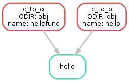

.. getting_started-examples:

========
Examples
========

Most of the examples below assume that Snakemake is executed in a project-specific root directory.
The paths in the Snakefiles below are relative to this directory.
We follow the convention to use different subdirectories for different intermediate results, e.g., ``mapped/`` for mapped sequence reads in ``.bam`` files, etc.

Cufflinks
=========

`Cufflinks <http://cole-trapnell-lab.github.io/cufflinks/>`_ is a tool to assemble transcripts, calculate abundance and conduct a differential expression analysis on RNA-Seq data. This example shows how to create a typical Cufflinks workflow with Snakemake.
It assumes that mapped RNA-Seq data for four samples 101-104 is given as bam files.

* For each sample, transcripts are assembled with ``cufflinks`` (rule ``assembly``).
* Assemblies are merged into one gtf with ``cuffmerge`` (rule ``merge_assemblies``).
* A comparison to the hg19 gtf-track is conducted (rule ``compare_assemblies``).
* Finally, differential expressions are calculated on the found transcripts (rule ``diffexp``).

.. code-block:: python

    # path to track and reference
    TRACK   = 'hg19.gtf'
    REF     = 'hg19.fa'

    # sample names and classes
    CLASS1  = '101 102'.split()
    CLASS2  = '103 104'.split()
    SAMPLES = CLASS1 + CLASS2

    # path to bam files
    CLASS1_BAM = expand('mapped/{sample}.bam', sample=CLASS1)
    CLASS2_BAM = expand('mapped/{sample}.bam', sample=CLASS2)

    rule all:
        input:
            'diffexp/isoform_exp.diff',
            'assembly/comparison'

    rule assembly:
        input:
            'mapped/{sample}.bam'
        output:
            'assembly/{sample}/transcripts.gtf',
            dir='assembly/{sample}'
        threads: 4
        shell:
            'cufflinks --num-threads {threads} -o {output.dir} '
            '--frag-bias-correct {REF} {input}'

    rule compose_merge:
        input:
            expand('assembly/{sample}/transcripts.gtf', sample=SAMPLES)
        output:
            txt='assembly/assemblies.txt'
        run:
            with open(output.txt, 'w') as out:
                print(*input, sep="\n", file=out)

    rule merge_assemblies:
        input:
            'assembly/assemblies.txt'
        output:
            'assembly/merged/merged.gtf', dir='assembly/merged'
        shell:
            'cuffmerge -o {output.dir} -s {REF} {input}'

    rule compare_assemblies:
        input:
            'assembly/merged/merged.gtf'
        output:
            'assembly/comparison/all.stats',
            dir='assembly/comparison'
        shell:
            'cuffcompare -o {output.dir}all -s {REF} -r {TRACK} {input}'

    rule diffexp:
        input:
            class1=CLASS1_BAM,
            class2=CLASS2_BAM,
            gtf='assembly/merged/merged.gtf'
        output:
            'diffexp/gene_exp.diff', 'diffexp/isoform_exp.diff'
        params:
            class1=",".join(CLASS1_BAM),
            class2=",".join(CLASS2_BAM)
        threads: 8
        shell:
            'cuffdiff --num-threads {threads} {gtf} {params.class1} {params.class2}'

The execution plan of Snakemake for this workflow can be visualized with the following DAG.

.. image:: img/cufflinks-dag.png
    :alt: Cufflinks Workflow DAG

Building a C Program
====================

GNU Make is primarily used to build C/C++ code.
Snakemake can do the same, while providing a superior readability due to less obscure variables inside the rules.

The following example Makefile was adapted from http://www.cs.colby.edu/maxwell/courses/tutorials/maketutor/.

.. code-block:: makefile

    IDIR=../include
    ODIR=obj
    LDIR=../lib

    LIBS=-lm

    CC=gcc
    CFLAGS=-I$(IDIR)

    _HEADERS = hello.h
    HEADERS = $(patsubst %,$(IDIR)/%,$(_HEADERS))

    _OBJS = hello.o hellofunc.o
    OBJS = $(patsubst %,$(ODIR)/%,$(_OBJS))

    # build the executable from the object files
    hello: $(OBJS)
            $(CC) -o $@ $^ $(CFLAGS)

    # compile a single .c file to an .o file
    $(ODIR)/%.o: %.c $(HEADERS)
            $(CC) -c -o $@ $< $(CFLAGS)

    # clean up temporary files
    .PHONY: clean
    clean:
            rm -f $(ODIR)/*.o *~ core $(IDIR)/*~

A Snakefile can be easily written as

.. code-block:: python

    from os.path import join

    IDIR = '../include'
    ODIR = 'obj'
    LDIR = '../lib'

    LIBS = '-lm'

    CC = 'gcc'
    CFLAGS = '-I' + IDIR

    _HEADERS = ['hello.h']
    HEADERS = [join(IDIR, hfile) for hfile in _HEADERS]

    _OBJS = ['hello.o', 'hellofunc.o']
    OBJS = [join(ODIR, ofile) for ofile in _OBJS]

    rule hello:
        """build the executable from the object files"""
        output:
            'hello'
        input:
            OBJS
        shell:
            "{CC} -o {output} {input} {CFLAGS} {LIBS}"

    rule c_to_o:
        """compile a single .c file to an .o file"""
        output:
            temp('{ODIR}/{name}.o')
        input:
            src='{name}.c',
            headers=HEADERS
        shell:
            "{CC} -c -o {output} {input.src} {CFLAGS}"

    rule clean:
        """clean up temporary files"""
        shell:
            "rm -f   *~  core  {IDIR}/*~"

As can be seen, the shell calls become more readable, e.g. ``"{CC} -c -o {output} {input} {CFLAGS}"`` instead of ``$(CC) -c -o $@ $< $(CFLAGS)``. Further, Snakemake automatically deletes ``.o``-files when they are not needed anymore since they are marked as ``temp``.

Building a Paper with LaTeX
===========================

Building a scientific paper can be automated by Snakemake as well.
Apart from compiling LaTeX code and invoking BibTeX, we provide a special rule to zip the needed files for online submission.

We first provide a Snakefile ``tex.rules`` that contains rules that can be shared for any latex build task:

.. code-block:: python

    ruleorder:  tex2pdf_with_bib > tex2pdf_without_bib

    rule tex2pdf_with_bib:
        input:
            '{name}.tex',
            '{name}.bib'
        output:
            '{name}.pdf'
        shell:
            """
            pdflatex {wildcards.name}
            bibtex {wildcards.name}
            pdflatex {wildcards.name}
            pdflatex {wildcards.name}
            """

    rule tex2pdf_without_bib:
        input:
            '{name}.tex'
        output:
            '{name}.pdf'
        shell:
            """
            pdflatex {wildcards.name}
            pdflatex {wildcards.name}
            """

    rule texclean:
        shell:
            "rm -f  *.log *.aux *.bbl *.blg *.synctex.gz"

Note how we distinguish between a ``.tex`` file with and without a corresponding ``.bib`` with the same name.
Assuming that both ``paper.tex`` and ``paper.bib`` exist, an ambiguity arises: Both rules are, in principle, applicable.
This would lead to an ``AmbiguousRuleException``, but since we have specified an explicit rule order in the file, it is clear that in this case the rule ``tex2pdf_with_bib`` is to be preferred.
If the ``paper.bib`` file does not exist, that rule is not even applicable, and the only option is to execute rule ``tex2pdf_without_bib``.

Assuming that the above file is saved as ``tex.rules``, the actual documents are then built from a specific Snakefile that includes these common rules:

.. code-block:: python

    DOCUMENTS = ['document', 'response-to-editor']
    TEXS = [doc+".tex" for doc in DOCUMENTS]
    PDFS = [doc+".pdf" for doc in DOCUMENTS]
    FIGURES = ['fig1.pdf']

    include:
        'tex.smrules'

    rule all:
        input:
            PDFS

    rule zipit:
        output:
            'upload.zip'
        input:
            TEXS, FIGURES, PDFS
        shell:
            'zip -T {output} {input}'

    rule pdfclean:
        shell:
            "rm -f  {PDFS}"

Hence the user can perform 4 different tasks.
Build all PDFs:

.. code-block:: console

    $ snakemake

Create a zip-file for online submissions:

.. code-block:: console

    $ snakemake zipit

Clean up all PDFs:

.. code-block:: console

    $ snakemake pdfclean

Clean up latex temporary files:

.. code-block:: console

    $ snakemake texclean

The following DAG of jobs would be executed upon a full run:

.. image:: img/latex-dag.png
    :alt: LaTeX Workflow DAG
