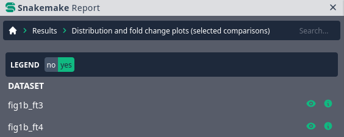

.. _snakefiles-reports:

=======
Reports
=======

From Snakemake 5.1 on, it is possible to automatically generate detailed self-contained HTML reports that you can easily move and share. 
They encompass runtime statistics, provenance information and workflow topology by default, and workflow developers can also specify and annotate results for inclusion.
For smaller default reports, these can be a single :ref:`snakefiles-self_contained_html_file`.
For more complex reports, one can generate a :ref:`snakefiles-self_contained_zip_archive`, with a contained ``report.html`` as the main entry point.
**As an example, the report of the Snakemake rolling paper can be found** `here <https://snakemake.github.io/resources/report.html>`__.

.. _snakefiles-including_results_in_a_report:

Including results in a report
-----------------------------

For including results into the report, the Snakefile has to be annotated with additional information.
Each output file that shall be part of the report has to be marked with the ``report`` flag, which optionally points to a caption in `restructured text format <https://docutils.sourceforge.io/docs/user/rst/quickstart.html>`_ and allows to define a ``category`` for grouping purposes.
Moreover, a global workflow description can be defined via the ``report`` directive.
Consider the following example:

.. code-block:: python

  report: "report/workflow.rst"

  rule all:
      input:
          ["fig1.svg", "fig2.png", "testdir"]

  rule c:
      output:
          "test.{i}.out"
      container:
          "docker://continuumio/miniconda3:4.4.10"
      conda:
          "envs/test.yaml"
      shell:
          "sleep `shuf -i 1-3 -n 1`; touch {output}"

  rule a:
      input:
          expand("test.{i}.out", i=range(10))
      output:
          report("fig1.svg", caption="report/fig1.rst", category="Step 1")
      shell:
          "sleep `shuf -i 1-3 -n 1`; cp data/fig1.svg {output}"

  rule b:
      input:
          expand("{model}.{i}.out", i=range(10))
      output:
          report("fig2.png", caption="report/fig2.rst", category="Step 2", subcategory="{model}")
      shell:
          "sleep `shuf -i 1-3 -n 1`; cp data/fig2.png {output}"

  rule d:
      output:
          report(
              directory("testdir"), 
              patterns=["{name}.txt"], 
              caption="report/somedata.rst", 
              category="Step 3")
      shell:
          "mkdir {output}; for i in 1 2 3; do echo $i > {output}/$i.txt; done"

As can be seen, we define a global description which is contained in the file ``report/workflow.rst``.
In addition, we mark ``fig1.svg`` and ``fig2.png`` for inclusion into the report, while in both cases specifying a caption text via again referring to a restructured text file.
Note the paths to the ``.rst``-files are interpreted relative to the current Snakefile.

Inside the ``.rst``-files you can use `Jinja2 <https://jinja.palletsprojects.com>`_ templating to access context information.
In case of the global description, you can access the config dictionary via ``{{ snakemake.config }}``, (e.g., use ``{{ snakemake.config["mykey"] }}`` to access the key ``mykey``).
In case of output files, you can access the same values as available with the :ref:`script directive <snakefiles-external_scripts>` (e.g., ``snakemake.wildcards``).

When marking files for inclusion in the report, a ``category`` and a ``subcategory`` can be given, allowing to group results in of the report.
For both, wildcards (like ``{model}`` see rule b in the example), are automatically replaced with the respective values from the corresponding job.

The last rule ``d`` creates a directory with several files, here mimicking the case that it is impossible to specify exactly which files will be created while writing the workflow (e.g. it might depend on the data).
Nevertheless, it is still possible to include those files one by one into the report by defining inclusion patterns (here ``patterns=["{name}.txt"]``) along with the report flag.
When creating the report, Snakemake will scan the directory for files matching the given patterns and include all of them in the report.
Wildcards in those patterns are made available in the jinja-templated caption document along with the rules wildcards in the ``snakemake.wildcards`` object.

If the output of a rule is a directory with an HTML file hierarchy, it is also possible to specify an entry-point HTML file for inclusion into the report, instead of the ``patterns`` approach from above.
This works as follows:

.. code-block:: python

    rule generate_html_hierarchy:
        output:
            report(directory("test"), caption="report/caption.rst", htmlindex="test.html")
        shell:
            """
            # mimic writing of an HTML hierarchy
            mkdir test
            cp template.html test/test.html
            mkdir test/js
            echo \"alert('test')\" > test/js/test.js
            """

Defining file labels
^^^^^^^^^^^^^^^^^^^^

In addition to category, and subcategory, it is possible (and highly recommended!) to define a dictionary of labels for each report item.
By that, the actual filename will be hidden in the report and instead a table with the label keys as columns and the values in the respective row for the file will be displayed.
This can lead to less technical reports that abstract away the fact that the results of the analysis are actually files.
Consider the following modification of rule ``b`` from above:

.. code-block:: python

    rule b:
      input:
          expand("{model}.{i}.out", i=range(10))
      output:
          report(
              "fig2.png", 
              caption="report/fig2.rst", 
              category="Step 2", 
              subcategory="{model}",
              labels={
                  "model": "{model}",
                  "figure": "some plot"
              }
          )
      shell:
          "sleep `shuf -i 1-3 -n 1`; cp data/fig2.png {output}"

If all results in a particular category/subcategory share the same label and both values occur once for each combination of other labels,
Snakemake displays the label as a toggle switch above the result menu.
This behavior can be used to, for example, switch between different versions of a plot, one with and one without a legend, see the example below (there, the legend label, with values yes/no, is automatically rendered as a toggle switch):

Determining category, subcategory, and labels dynamically via functions
^^^^^^^^^^^^^^^^^^^^^^^^^^^^^^^^^^^^^^^^^^^^^^^^^^^^^^^^^^^^^^^^^^^^^^^

Similar to e.g. with input file and parameter definition (see :ref:`snakefiles-input_functions`), ``category`` and a ``subcategory`` and ``labels`` can be specified by pointing to a function that takes ``wildcards`` as the first argument (and optionally in addition ``input``, ``output``, ``params`` in any order).
The function is expected to return a string or number (int, float, numpy types), or, in case of labels, a dict with strings as keys and strings or numbers as values.

Linking between items
^^^^^^^^^^^^^^^^^^^^^

From captions
"""""""""""""

In every ``.rst`` document (i.e. in the captions), you can link to

* the **Workflow** panel (with ``Rules_``),
* the **Statistics** panel (with ``Statistics_``),
* any **category** panel (with ``Mycategory_``, while ``Mycategory`` is the name given for the category argument of the report flag). E.g., with above example, you could write ``see `Step 2`_`` in order to link to the section with the results that have been assigned to the category ``Step 2``.
* any **file** marked with the report flag (with ``myfile.txt_``, while ``myfile.txt`` is the basename of the file, without any leading directories). E.g., with above example, you could write ``see fig2.png_`` in order to link to the result in the report document.

For details about the hyperlink mechanism of restructured text see `here <https://docutils.sourceforge.io/docs/user/rst/quickref.html#hyperlink-targets>`__.

From results
""""""""""""

From within results that are included into the report, you can link to other report items.
This works by using the ``snakemake.report_href()`` method that is available from within :ref:`python scripts <snakefiles-external_scripts>`.
The method takes the path to the target report item in exactly the same form as it is given in the Snakefile,
and optionally can be extended to target child paths or by URL arguments.
For example, consider the following Snakefile:

.. code-block:: python

    rule a:
        input:
            report("test.html"),
            report(
                "subdir",
                patterns=["{name}.html"],
            )
        output:
            report(
                "test2.html",
            )
        script:
            "test_script.py"

Inside of the script, we can now use ``snakemake.report_href()`` to create a link to the file ``test.html`` such that it can be accessed from the file ``test2.html``:

.. code-block:: python

    import textwrap

    with open(snakemake.output[0], "w") as f:
        print(
            textwrap.dedent(f"""
            <html>
                <head>
                    <title>Report</title>
                </head>
                <body>
                    <a href={snakemake.report_href("test.html")}>Link to test.html</a>
                </body>
            </html>
            """
            ),
            file=f,
        )

Note that you will rarely directly generate HTML like this in a Python script within a Snakemake workflow.
Rather, you might want to access ``snakemake.report_href()`` when e.g. generating a table which is later rendered into HTML by e.g. `Datavzrd <https://datavzrd.github.io>`__ (also see :ref:`interaction_visualization_reporting_tutorial`).

In case you want to refer to a file that is inside of a directory that is included into the Snakemake report, you can do so using the ``child_path`` method:

.. code-block:: python

    import textwrap

    with open(snakemake.output[0], "w") as f:
        print(
            textwrap.dedent(f"""
            <html>
                <head>
                    <title>Report</title>
                </head>
                <body>
                    <a href={snakemake.report_href("subdir").child_path("foo.html")}>Link to test.html</a>
                </body>
            </html>
            """
            ),
            file=f,
        )

Further, using ``url_args()`` you can add URL arguments and using ``anchor()`` you can add a target anchor to the link, e.g. to scroll to a specific section of the target document:

.. code-block:: python

    import textwrap

    with open(snakemake.output[0], "w") as f:
        print(
            textwrap.dedent(f"""
            <html>
                <head>
                    <title>Report</title>
                </head>
                <body>
                    <a href={snakemake.report_href("subdir").child_path("foo.html").url_args(someparam=5).anchor("mysection")}>Link to test.html</a>
                </body>
            </html>
            """
            ),
            file=f,
        )

.. _snakefiles-rendering_reports:

Rendering reports
-----------------

All the metadata contained in the report (e.g. runtime statistics) are automatically collected during the rendering of the report.
These statistics are obtained from the metadata that is stored in the ``.snakemake`` directory inside your working directory.

.. _snakefiles-self_contained_html_file:

Self-contained HTML file
^^^^^^^^^^^^^^^^^^^^^^^^

To create a default report simply run

.. code-block:: bash

    snakemake --report

after your workflow has finished successfully.
This will implicitly assume a report file name of ``report.html`` and will create this self-contained HTML report.
If you want to give your report a custom name, you can do so by specifying this on the command-line:

.. code-block:: bash

    snakemake --report my_report.html

As specifying an HTML file for the report will always embed any user-defined report outputs into the same HTML file, this report output type is only suitable for smaller reports.

.. _snakefiles-self_contained_zip_archive:

Self-contained ZIP archive
^^^^^^^^^^^^^^^^^^^^^^^^^^

For anything more complex, it is recommended to generate a ``ZIP`` archive report.
For example, if you have lots of samples you report on, or if you specified lots of different workflow outputs for report inclusion.
To get such a self-contained ``ZIP`` archive, simply specify a ``.zip`` file name instead:

.. code-block:: bash

    snakemake --report some_report.zip

You can move this file wherever you need it and then unpack it.
The main entry point is always the ``report.html`` file in the main folder that this creates (for the above example, this folder will be named ``some_report``).
Just open that file in a web browser and explore your results.

Partial reports
^^^^^^^^^^^^^^^

The report can be restricted to particular jobs and results by specifying targets at the command line, analog to normal Snakemake execution.
For example, with

.. code-block:: bash

    snakemake fig1.svg --report report-short.html

the report contains only ``fig1.svg``.
This can be useful when a larger workflow has not yet run to completion, but you already want to explore some intermediate outputs in the report.
Or when you have multiple alternative target rules within the same workflow.

Custom layout
^^^^^^^^^^^^^

You can define an institute specific layout by providing a custom stylesheet:

.. code-block:: bash

    snakemake --report report.html --report-stylesheet custom-stylesheet.css

For example, this allows you to set a logo at the top (by using CSS to inject a background for the placeholder ``
``), or overwrite colors.

For an example with a custom stylesheet defining a logo, see :download:`the report here <../../tests/test_report/expected-results/report.html>` (with a custom branding for the University of Duisburg-Essen).
For the complete mechanics, you can also have a look at the `full example source code  <https://github.com/snakemake/snakemake/tree/main/tests/test_report/>`__ and :download:`the custom stylesheet with the logo definition <../../tests/test_report/custom-stylesheet.css>`.

