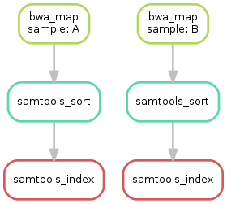

.. _tutorial-basics:

Basics: An example workflow
---------------------------

.. _Snakemake: https://snakemake.readthedocs.io
.. _Snakemake homepage: https://snakemake.readthedocs.io
.. _GNU Make: https://www.gnu.org/software/make
.. _Python: https://www.python.org
.. _BWA: http://bio-bwa.sourceforge.net
.. _SAMtools: https://www.htslib.org
.. _BCFtools: https://www.htslib.org
.. _Pandas: https://pandas.pydata.org
.. _Miniconda: https://conda.pydata.org/miniconda.html
.. _Conda: https://conda.pydata.org
.. _Bash: https://www.tldp.org/LDP/Bash-Beginners-Guide/html
.. _Atom: https://atom.io
.. _Anaconda: https://anaconda.org
.. _Graphviz: https://www.graphviz.org
.. _RestructuredText: https://docutils.sourceforge.io/docs/user/rst/quickstart.html
.. _data URI: https://developer.mozilla.org/en-US/docs/Web/HTTP/data_URIs
.. _JSON: https://json.org
.. _YAML: https://yaml.org
.. _DRMAA: https://www.drmaa.org
.. _rpy2: https://rpy2.github.io
.. _R: https://www.r-project.org
.. _Rscript: https://stat.ethz.ch/R-manual/R-devel/library/utils/html/Rscript.html
.. _PyYAML: https://pyyaml.org
.. _Docutils: https://docutils.sourceforge.io
.. _Bioconda: https://bioconda.github.io
.. _Vagrant: https://www.vagrantup.com
.. _Vagrant Documentation: https://docs.vagrantup.com
.. _Blogpost: https://blog.osteel.me/posts/2015/01/25/how-to-use-vagrant-on-windows.html
.. _slides: https://slides.com/johanneskoester/deck-1

Please make sure that you have **activated** the environment we created before, and that you have an open terminal in the working directory you have created.

**A Snakemake workflow is defined by specifying rules in a Snakefile**.
**Rules decompose the workflow into small steps** (e.g., the application of a single tool) by specifying how to create sets of **output files** from sets of **input files**.
Snakemake automatically **determines the dependencies** between the rules by matching file names.

The Snakemake language extends the Python language, adding syntactic structures for rule definition and additional controls.
All added syntactic structures begin with a keyword followed by a code block that is either in the same line or indented and consisting of multiple lines.
The resulting syntax resembles that of original Python constructs.

In the following, we will introduce the Snakemake syntax by creating an example workflow.
The workflow comes from the domain of genome analysis.
It maps sequencing reads to a reference genome and call variants on the mapped reads.
The tutorial does not require you to know what this is about.
Nevertheless, we provide some background in the following paragraph.

.. _tutorial-background:

Background
::::::::::

The genome of a living organism encodes its hereditary information.
It serves as a blueprint for proteins, which form living cells, carry information
and drive chemical reactions. Differences between populations, species, cancer
cells and healthy tissue, as well as syndromes or diseases can be reflected and
sometimes caused by changes in the genome.
This makes the genome a major target of biological and medical research.
Today, it is often analyzed with DNA sequencing, producing gigabytes of data from
a single biological sample (e.g. a biopsy of some tissue).
For technical reasons, DNA sequencing cuts the DNA of a sample into millions
of small pieces, called **reads**.
In order to recover the genome of the sample, one has to map these reads against
a known **reference genome** (e.g., the human one obtained during the famous
`human genome project <https://en.wikipedia.org/wiki/Human_Genome_Project>`_).
This task is called **read mapping**.
Often, it is of interest where an individual genome is different from the species-wide consensus
represented with the reference genome.
Such differences are called **variants**. They are responsible for harmless individual
differences (like eye color), but can also cause diseases like cancer.
By investigating the differences between the all mapped reads
and the reference sequence at one position, variants can be detected.
This is a statistical challenge, because they have
to be distinguished from artifacts generated by the sequencing process.

Step 1: Mapping reads
:::::::::::::::::::::

Our first Snakemake rule maps reads of a given sample to a given reference genome (see :ref:`tutorial-background`).
For this, we will use the tool bwa_, specifically the subcommand ``bwa mem``.
In the working directory, **create a new file** called ``Snakefile`` with an editor of your choice.
We propose to use the Atom_ editor, since it provides out-of-the-box syntax highlighting for Snakemake.
In the Snakefile, define the following rule:

.. code:: python

    rule bwa_map:
        input:
            "data/genome.fa",
            "data/samples/A.fastq"
        output:
            "mapped_reads/A.bam"
        shell:
            "bwa mem {input} | samtools view -Sb - > {output}"

.. sidebar:: Note

    A common error is to forget the comma between the input or output items.
    Since Python concatenates subsequent strings, this can lead to unexpected behavior.

A Snakemake rule has a name (here ``bwa_map``) and a number of directives, here ``input``, ``output`` and ``shell``.
The ``input`` and ``output`` directives are followed by lists of files that are expected to be used or created by the rule.
In the simplest case, these are just explicit Python strings.
The ``shell`` directive is followed by a Python string containing the shell command to execute.
In the shell command string, we can refer to elements of the rule via braces notation (similar to the Python format function).
Here, we refer to the output file by specifying ``{output}`` and to the input files by specifying ``{input}``.
Since the rule has multiple input files, Snakemake will concatenate them separated by a whitespace.
In other words, Snakemake will replace ``{input}`` with ``data/genome.fa data/samples/A.fastq`` before executing the command.
The shell command invokes ``bwa mem`` with reference genome and reads, and pipes the output into ``samtools`` which creates a compressed `BAM <https://en.wikipedia.org/wiki/Binary_Alignment_Map>`_ file containing the alignments.
The output of ``samtools`` is piped into the output file defined by the rule.

When a workflow is executed, Snakemake tries to generate given **target** files.
Target files can be specified via the command line.
By executing

.. code:: console

    $ snakemake -np mapped_reads/A.bam

in the working directory containing the Snakefile, we tell Snakemake to generate the target file ``mapped_reads/A.bam``.
Since we used the ``-n`` (or ``--dry-run``) flag, Snakemake will only show the execution plan instead of actually perform the steps.
The ``-p`` flag instructs Snakemake to also print the resulting shell command for illustration.
To generate the target files, **Snakemake applies the rules given in the Snakefile in a top-down way**.
The application of a rule to generate a set of output files is called **job**.
For each input file of a job, Snakemake again (i.e. recursively) determines rules that can be applied to generate it.
This yields a `directed acyclic graph (DAG) <https://en.wikipedia.org/wiki/Directed_acyclic_graph>`_ of jobs where the edges represent dependencies.
So far, we only have a single rule, and the DAG of jobs consists of a single node.
Nevertheless, we can **execute our workflow** with

.. code:: console

    $ snakemake --cores 1 mapped_reads/A.bam

Whenever executing a workflow, you need to specify the number of cores to use.
For this tutorial, we will use a single core for now. 
Later you will see how parallelization works.
Note that, after completion of above command, Snakemake will not try to create ``mapped_reads/A.bam`` again, because it is already present in the file system.
Snakemake **only re-runs jobs if one of the input files is newer than one of the output files or one of the input files will be updated by another job**.

Step 2: Generalizing the read mapping rule
::::::::::::::::::::::::::::::::::::::::::

Obviously, the rule will only work for a single sample with reads in the file ``data/samples/A.fastq``.
However, Snakemake allows to **generalize rules by using named wildcards**.
Simply replace the ``A`` in the second input file and in the output file with the wildcard ``{sample}``, leading to

.. code:: python

    rule bwa_map:
        input:
            "data/genome.fa",
            "data/samples/{sample}.fastq"
        output:
            "mapped_reads/{sample}.bam"
        shell:
            "bwa mem {input} | samtools view -Sb - > {output}"

.. sidebar:: Note

  Note that if a rule has multiple output files, Snakemake requires them to all
  have exactly the same wildcards. Otherwise, it could happen
  that two jobs from the same rule want to write the same file.

When Snakemake determines that this rule can be applied to generate a target file by replacing the wildcard ``{sample}`` in the output file with an appropriate value, it will propagate that value to all occurrences of ``{sample}`` in the input files and thereby determine the necessary input for the resulting job.
Note that you can have multiple wildcards in your file paths, however, to avoid conflicts with other jobs of the same rule, **all output files** of a rule have to **contain exactly the same wildcards**.

When executing

.. code:: console

    $ snakemake -np mapped_reads/B.bam

Snakemake will determine that the rule ``bwa_map`` can be applied to generate the target file by replacing the wildcard ``{sample}`` with the value ``B``.
In the output of the dry-run, you will see how the wildcard value is propagated to the input files and all filenames in the shell command.
You can also **specify multiple targets**, e.g.:

.. code:: console

    $ snakemake -np mapped_reads/A.bam mapped_reads/B.bam

Some Bash_ magic can make this particularly handy. For example, you can alternatively compose our multiple targets in a single pass via

.. code:: console

    $ snakemake -np mapped_reads/{A,B}.bam

Note that this is not a special Snakemake syntax. Bash is just expanding the given path into two, one for each element of the set ``{A,B}``.

In both cases, you will see that Snakemake only proposes to create the output file ``mapped_reads/B.bam``.
This is because you already executed the workflow before (see the previous step) and no input file is newer than the output file ``mapped_reads/A.bam``.
You can update the file modification date of the input file
``data/samples/A.fastq`` via

.. code:: console

    $ touch data/samples/A.fastq

and see how Snakemake wants to re-run the job to create the file ``mapped_reads/A.bam`` by executing

.. code:: console

    $ snakemake -np mapped_reads/A.bam mapped_reads/B.bam

Step 3: Sorting read alignments
:::::::::::::::::::::::::::::::

For later steps, we need the read alignments in the BAM files to be sorted.
This can be achieved with the samtools_ command.
We add the following rule beneath the ``bwa_map`` rule:

.. code:: python

    rule samtools_sort:
        input:
            "mapped_reads/{sample}.bam"
        output:
            "sorted_reads/{sample}.bam"
        shell:
            "samtools sort -T sorted_reads/{wildcards.sample} "
            "-O bam {input} > {output}"

.. sidebar:: Note

  It is best practice to have subsequent steps of a workflow in separate, unique, output folders. This keeps the working directory structured. Further, such unique prefixes allow Snakemake to prune the search space for dependencies.

This rule will take the input file from the ``mapped_reads`` directory and store a sorted version in the ``sorted_reads`` directory.
Note that Snakemake **automatically creates missing directories** before jobs are executed.
For sorting, ``samtools`` requires a prefix specified with the flag ``-T``.
Here, we need the value of the wildcard ``sample``.
Snakemake allows to access wildcards in the shell command via the ``wildcards`` object that has an attribute with the value for each wildcard.

When issuing

.. code:: console

    $ snakemake -np sorted_reads/B.bam

you will see how Snakemake wants to run first the rule ``bwa_map`` and then the rule ``samtools_sort`` to create the desired target file:
as mentioned before, the dependencies are resolved automatically by matching file names.

Step 4: Indexing read alignments and visualizing the DAG of jobs
::::::::::::::::::::::::::::::::::::::::::::::::::::::::::::::::

Next, we need to use samtools_ again to index the sorted read alignments for random access.
This can be done with the following rule:

.. code:: python

    rule samtools_index:
        input:
            "sorted_reads/{sample}.bam"
        output:
            "sorted_reads/{sample}.bam.bai"
        shell:
            "samtools index {input}"

.. sidebar:: Note

  Snakemake uses the Python format mini language to format shell commands.
  Sometimes you have to use braces for something else in a shell command.
  In that case, you have to escape them by doubling, e.g.,
  ``ls {{A,B}}.txt``.

Having three steps already, it is a good time to take a closer look at the resulting DAG of jobs.
By executing

.. code:: console

    $ snakemake --dag sorted_reads/{A,B}.bam.bai | dot -Tsvg > dag.svg

we create a **visualization of the DAG** using the ``dot`` command provided by Graphviz_.
For the given target files, Snakemake specifies the DAG in the dot language and pipes it into the ``dot`` command, which renders the definition into SVG format.
The rendered DAG is piped into the file ``dag.svg`` and will look similar to this:

The DAG contains a node for each job and edges representing the dependencies.
Jobs that don't need to be run because their output is up-to-date are dashed.
For rules with wildcards, the value of the wildcard for the particular job is displayed in the job node.

Exercise
........

* Run parts of the workflow using different targets. Recreate the DAG and see how different rules become dashed because their output is present and up-to-date.

Step 5: Calling genomic variants
::::::::::::::::::::::::::::::::

The next step in our workflow will aggregate the mapped reads from all samples and jointly call genomic variants on them (see :ref:`tutorial-background`).
For the variant calling, we will combine the two utilities samtools_ and bcftools_.
Snakemake provides a **helper function for collecting input files** that helps us to describe the aggregation in this step.
With

.. code:: python

    expand("sorted_reads/{sample}.bam", sample=SAMPLES)

we obtain a list of files where the given pattern ``"sorted_reads/{sample}.bam"`` was formatted with the values in a given list of samples ``SAMPLES``, i.e.

.. code:: python

    ["sorted_reads/A.bam", "sorted_reads/B.bam"]

The function is particularly useful when the pattern contains multiple wildcards.
For example,

.. code:: python

    expand("sorted_reads/{sample}.{replicate}.bam", sample=SAMPLES, replicate=[0, 1])

would create the product of all elements of ``SAMPLES`` and the list ``[0, 1]``, yielding

.. code:: python

    ["sorted_reads/A.0.bam", "sorted_reads/A.1.bam", "sorted_reads/B.0.bam", "sorted_reads/B.1.bam"]

Here, we use only the simple case of ``expand``.
We first let Snakemake know which samples we want to consider.
Remember that Snakemake works top-down, it does not automatically infer this from, e.g., the fastq files in the data folder.
Also remember that Snakefiles are in principle Python code enhanced by some declarative statements to define workflows.
Hence, we can define the list of samples ad-hoc in plain Python at the top of the Snakefile:

.. code:: python

    SAMPLES = ["A", "B"]

Later, we will learn about more sophisticated ways like **config files**.
Now, we can add the following rule to our Snakefile:

.. code:: python

    rule bcftools_call:
        input:
            fa="data/genome.fa",
            bam=expand("sorted_reads/{sample}.bam", sample=SAMPLES),
            bai=expand("sorted_reads/{sample}.bam.bai", sample=SAMPLES)
        output:
            "calls/all.vcf"
        shell:
            "samtools mpileup -g -f {input.fa} {input.bam} | "
            "bcftools call -mv - > {output}"

.. sidebar:: Note

  If you name input or output files like above, their order won't be preserved when referring them as ``{input}``.
  Further, note that named and not named (i.e., positional) input and output files can be combined, but the positional ones must come first, equivalent to Python functions with keyword arguments.

With multiple input or output files, it is sometimes handy to refer them separately in the shell command.
This can be done by **specifying names for input or output files** (here, e.g., ``fa=...``).
The files can then be referred in the shell command via, e.g., ``{input.fa}``.
For **long shell commands** like this one, it is advisable to **split the string over multiple indented lines**.
Python will automatically merge it into one.
Further, you will notice that the **input or output file lists can contain arbitrary Python statements**, as long as it returns a string, or a list of strings.
Here, we invoke our ``expand`` function to aggregate over the aligned reads of all samples.

Exercise
........

* obtain the updated DAG of jobs for the target file ``calls/all.vcf``, it should look like this:

.. image:: workflow/dag_call.png
   :align: center

.. _tutorial-script:

Step 6: Using custom scripts
::::::::::::::::::::::::::::

Usually, a workflow not only consists of invoking various tools, but also contains custom code to e.g. calculate summary statistics or create plots.
While Snakemake also allows you to directly :ref:`write Python code inside a rule <.. _snakefiles-rules>`, it is usually reasonable to move such logic into separate scripts.
For this purpose, Snakemake offers the ``script`` directive.
Add the following rule to your Snakefile:

.. code:: python

    rule plot_quals:
        input:
            "calls/all.vcf"
        output:
            "plots/quals.svg"
        script:
            "scripts/plot-quals.py"

This rule shall generate a histogram of the quality scores that have been assigned to the variant calls in the file ``calls/all.vcf``.
The actual Python code to generate the plot is hidden in the script ``scripts/plot-quals.py``.
Script paths are always relative to the referring Snakefile.
In the script, all properties of the rule like ``input``, ``output``, ``wildcards``, etc. are available as attributes of a global ``snakemake`` object.
Create the file ``scripts/plot-quals.py``, with the following content:

.. code:: python

    import matplotlib
    matplotlib.use("Agg")
    import matplotlib.pyplot as plt
    from pysam import VariantFile

    quals = [record.qual for record in VariantFile(snakemake.input[0])]
    plt.hist(quals)

    plt.savefig(snakemake.output[0])

.. sidebar:: Note

  It is best practice to use the script directive whenever an inline code block would have
  more than a few lines of code.

Although there are other strategies to invoke separate scripts from your workflow
(e.g., invoking them via shell commands), the benefit of this is obvious:
the script logic is separated from the workflow logic (and can be even shared between workflows),
but **boilerplate code like the parsing of command line arguments is unnecessary**.

Apart from Python scripts, it is also possible to use R scripts. In R scripts,
an S4 object named ``snakemake`` analog to the Python case above is available and
allows access to input and output files and other parameters. Here the syntax
follows that of S4 classes with attributes that are R lists, e.g. we can access
the first input file with ``snakemake@input[[1]]`` (note that the first file does
not have index 0 here, because R starts counting from 1). Named input and output
files can be accessed in the same way, by just providing the name instead of an
index, e.g. ``snakemake@input[["myfile"]]``.

For details and examples, see the :ref:`snakefiles-external_scripts` section in the Documentation.

Step 7: Adding a target rule
::::::::::::::::::::::::::::

So far, we always executed the workflow by specifying a target file at the command line.
Apart from filenames, Snakemake **also accepts rule names as targets** if the referred rule does not have wildcards.
Hence, it is possible to write target rules collecting particular subsets of the desired results or all results.
Moreover, if no target is given at the command line, Snakemake will define the **first rule** of the Snakefile as the target.
Hence, it is best practice to have a rule ``all`` at the top of the workflow which has all typically desired target files as input files.

Here, this means that we add a rule

.. code:: python

    rule all:
        input:
            "plots/quals.svg"

to the top of our workflow.
When executing Snakemake with

.. code:: console

    $ snakemake -n

.. sidebar:: Note

   In case you have mutliple reasonable sets of target files,
   you can add multiple target rules at the top of the Snakefile. While
   Snakemake will execute the first per default, you can target any of them via
   the command line (e.g., ``snakemake -n mytarget``).

the execution plan for creating the file ``plots/quals.svg`` which contains and summarizes all our results will be shown.
Note that, apart from Snakemake considering the first rule of the workflow as default target, **the appearance of rules in the Snakefile is arbitrary and does not influence the DAG of jobs**.

Exercise
........

* Create the DAG of jobs for the complete workflow.
* Execute the complete workflow and have a look at the resulting ``plots/quals.svg``.
* Snakemake provides handy flags for forcing re-execution of parts of the workflow. Have a look at the command line help with ``snakemake --help`` and search for the flag ``--forcerun``. Then, use this flag to re-execute the rule ``samtools_sort`` and see what happens.
* With ``--reason`` it is possible to display the execution reason for each job. Try this flag together with a dry-run and the ``--forcerun`` flag to understand the decisions of Snakemake.

Summary
:::::::

In total, the resulting workflow looks like this:

.. code:: console

    SAMPLES = ["A", "B"]

    rule all:
        input:
            "plots/quals.svg"

    rule bwa_map:
        input:
            "data/genome.fa",
            "data/samples/{sample}.fastq"
        output:
            "mapped_reads/{sample}.bam"
        shell:
            "bwa mem {input} | samtools view -Sb - > {output}"

    rule samtools_sort:
        input:
            "mapped_reads/{sample}.bam"
        output:
            "sorted_reads/{sample}.bam"
        shell:
            "samtools sort -T sorted_reads/{wildcards.sample} "
            "-O bam {input} > {output}"

    rule samtools_index:
        input:
            "sorted_reads/{sample}.bam"
        output:
            "sorted_reads/{sample}.bam.bai"
        shell:
            "samtools index {input}"

    rule bcftools_call:
        input:
            fa="data/genome.fa",
            bam=expand("sorted_reads/{sample}.bam", sample=SAMPLES),
            bai=expand("sorted_reads/{sample}.bam.bai", sample=SAMPLES)
        output:
            "calls/all.vcf"
        shell:
            "samtools mpileup -g -f {input.fa} {input.bam} | "
            "bcftools call -mv - > {output}"

    rule plot_quals:
        input:
            "calls/all.vcf"
        output:
            "plots/quals.svg"
        script:
            "scripts/plot-quals.py"
