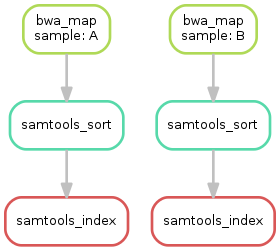
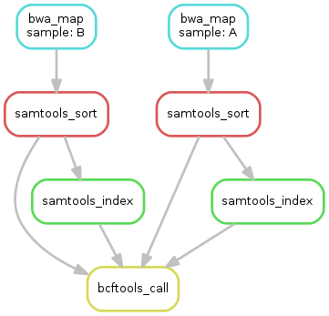

.. _tutorial-basics:

Basics: Syntax and Concepts
---------------------------

.. _Snakemake: https://snakemake.readthedocs.io
.. _Snakemake homepage: https://snakemake.readthedocs.io
.. _GNU Make: https://www.gnu.org/software/make
.. _Python: https://www.python.org
.. _BWA: http://bio-bwa.sourceforge.net
.. _SAMtools: https://www.htslib.org
.. _BCFtools: https://www.htslib.org
.. _Pandas: https://pandas.pydata.org
.. _Miniconda: https://conda.pydata.org/miniconda.html
.. _Conda: https://conda.pydata.org
.. _Bash: https://www.tldp.org/LDP/Bash-Beginners-Guide/html
.. _Visual Studio Code: https://code.visualstudio.com/
.. _Snakemake extension: https://marketplace.visualstudio.com/items?itemName=Snakemake.snakemake-lang
.. _remote extension: https://marketplace.visualstudio.com/items?itemName=ms-vscode.remote-explorer
.. _Anaconda: https://anaconda.org
.. _Graphviz: https://www.graphviz.org
.. _RestructuredText: https://docutils.sourceforge.io/docs/user/rst/quickstart.html
.. _data URI: https://developer.mozilla.org/en-US/docs/Web/HTTP/data_URIs
.. _JSON: https://json.org
.. _YAML: https://yaml.org
.. _DRMAA: https://www.drmaa.org
.. _rpy2: https://rpy2.github.io
.. _R: https://www.r-project.org
.. _Rscript: https://stat.ethz.ch/R-manual/R-devel/library/utils/html/Rscript.html
.. _PyYAML: https://pyyaml.org
.. _Docutils: https://docutils.sourceforge.io
.. _Bioconda: https://bioconda.github.io
.. _Vagrant: https://www.vagrantup.com
.. _Vagrant Documentation: https://docs.vagrantup.com
.. _Blogpost: https://blog.osteel.me/posts/2015/01/25/how-to-use-vagrant-on-windows.html
.. _slides: https://slides.com/johanneskoester/deck-1

Introduction
::::::::::::

In this tutorial, we will introduce the Snakemake syntax by creating a simple workflow from the domain of genome analysis.
It maps sequencing reads to a reference genome and calls variants on the mapped reads.
The tutorial does not require you to know what this is about.
Nevertheless, we provide some background in the following paragraph.

.. _tutorial-background:

Biological Background
^^^^^^^^^^^^^^^^^^^^^

The genome of a living organism encodes its hereditary information.
It serves as a blueprint for proteins, which form living cells, carry information and drive chemical reactions.
Differences between species, populations or individuals can be reflected by differences in the genome.
Some diseases can also be caused by genetic changes.
This makes the genome a major target of biological and medical research.

Nowadays, the genome can be analyzed through DNA sequencing, producing gigabytes of data from a single biological sample (e.g. a biopsy of some tissue).
For technical reasons, DNA sequencing cuts the DNA of a sample into millions of small pieces, called *reads*.
In order to recover the genome of the sample, one has to map these reads against a known *reference genome* (e.g. the human one, obtained during the famous `human genome project <https://en.wikipedia.org/wiki/Human_Genome_Project>`_).
This task is called **read mapping**.

Often, it is of interest where an individual genome is different from the species-wide consensus represented by the reference genome.
Such differences are called *variants*.
They are responsible for harmless individual differences (like eye color), but can also cause diseases like cancer.
By investigating the differences between the mapped reads and the reference sequence at a particular genome position, variants can be detected.
This is a statistical challenge, as these variants have to be distinguished from artifacts generated by the sequencing process.

1. The First Rule
::::::::::::::::::

.. attention::
    Please make sure that you are in the correct **working directory** and have **activated** your environment, as described in the Setup Section.

The first step of our task is to map reads of a given sample to a given reference genome (see :ref:`tutorial-background`).
For this, we can use the tool bwa_, specifically the subcommand ``bwa mem``, to write our very first *rule*.

In the working directory, **create a new file** called ``Snakefile`` with an editor of your choice.
We propose to use an integrated development environment (IDE) such as `Visual Studio Code`_, which provides a syntax highlighting `Snakemake extension`_ and a `remote extension`_ for directly using the IDE on a remote server.

In the `Snakefile`, define the following rule:

.. code:: python

    rule bwa_map:
        input:
            "data/genome.fa",
            "data/samples/A.fastq"
        output:
            "mapped_reads/A.bam"
        shell:
            "bwa mem {input} | samtools view -Sb - > {output}"

In Snakemake workflows are defined by specifying *rules* in a ``Snakefile``.
A *rule* is the most basic execution unit within a workflow.
It has a name (``bwa_map``) and a number of directives, like ``input``, ``output`` and ``shell``.

The ``input`` and ``output`` directives are followed by lists of files that are expected to be *used* or *created* by the rule.

The ``shell`` directive is followed by a string containing the shell command to execute.
The shell command invokes ``bwa mem`` with reference genome and reads, and pipes the output into ``samtools``, which creates a compressed `BAM <https://en.wikipedia.org/wiki/Binary_Alignment_Map>`_ file containing the alignments.

As you can see, we can refer to elements of the rule within the shell command string by putting them in **{braces}**.
Here, we refer to the output file by specifying ``{output}`` and to the input files by specifying ``{input}``.
Since the rule has multiple input files, Snakemake will concatenate them, separated by a whitespace.
In other words, Snakemake will replace ``{input}`` with ``data/genome.fa data/samples/A.fastq`` before executing the command.

When executing a workflow, Snakemake tries to generate given **target** files.
Target files can be specified via the command line:

.. code:: console

    $ snakemake -np mapped_reads/A.bam

in the working directory containing the Snakefile, we tell Snakemake to generate the target file ``mapped_reads/A.bam``.
Since we have used the ``-n`` (or ``--dry-run``) flag here, Snakemake will only show the execution plan instead of actually performing the steps.
The ``-p`` flag instructs Snakemake to also print the resulting shell command for illustration.

To generate the target files, **Snakemake applies the rules given in the Snakefile in a top-down way**.
The application of a rule to generate a set of output files is called **job**.
For each input file of a job, Snakemake again (i.e. recursively) determines rules that can be applied to generate it.
This yields a `directed acyclic graph (DAG) <https://en.wikipedia.org/wiki/Directed_acyclic_graph>`_ of jobs where the edges represent dependencies.
So far, we only have a single rule, and the DAG of jobs consists of a single node.
Nevertheless, we can **execute our workflow** with

.. code:: console

    $ snakemake --cores 1 mapped_reads/A.bam

Whenever you execute a workflow, you need to specify the number of cores to use.
For this tutorial, we will use a single core for now.
Later, you will see how to parallelize tasks.

Note that, if you try to run that command a second time, Snakemake will not try to create ``mapped_reads/A.bam`` again.
That is because it is already present in the file system.
Snakemake will **only** re-runs jobs if one of the input files is newer than one of the output files, or one of the input files will be updated by another job.

.. tip::

  It is best practice to have subsequent steps of a workflow in separate, unique, output folders. 
  This keeps the working directory structured. 
  Further, the directory prefixes allow Snakemake to quickly discard rules when searching for rules that produce the requested input. 
  This accelerates the resolution of rule dependencies in a workflow.

2. Generalizing Rules
::::::::::::::::::::::

Obviously, this rule will only work for a single sample with reads in the file ``data/samples/A.fastq``.
However, Snakemake allows **generalizing rules** through the use of **named wildcards**.
In your ``Snakefile``, replace the ``A`` in the second input file and in the output file with the wildcard ``{sample}``, leading to

.. code:: python

    rule bwa_map:
        input:
            "data/genome.fa",
            "data/samples/{sample}.fastq"
        output:
            "mapped_reads/{sample}.bam"
        shell:
            "bwa mem {input} | samtools view -Sb - > {output}"

.. note::
  You can have multiple wildcards in your file paths.
  However, to avoid conflicts with other jobs of the same rule, **all output files** of a rule have to contain **exactly the same wildcards**.

When Snakemake determines that this rule can be applied to generate a target file, it will propagate that value to all occurrences of the ``{sample}`` wildcard to determine the necessary input files.

When executing

.. code:: console

    $ snakemake -np mapped_reads/B.bam

Snakemake will determine that the rule ``bwa_map`` can be applied to generate the target file by replacing the wildcard ``{sample}`` with the value ``B``.
In the output of the dry-run, you will see how the wildcard value is propagated to the input files and all filenames in the shell command.

You can also **specify multiple targets**, for example:

.. code:: console

    $ snakemake -np mapped_reads/A.bam mapped_reads/B.bam

Adding in some Bash_ magic can make this particularly handy.
For example, you can also write our multiple targets as

.. code:: console

    $ snakemake -np mapped_reads/{A,B}.bam

This is not special Snakemake syntax.
Bash_ is just applying its `brace expansion <https://tldp.org/LDP/Bash-Beginners-Guide/html/sect_03_04.html>`_ to the set ``{A,B}``, creating the given path for each element and separating the resulting paths by a whitespace.

In both cases, you will see that Snakemake only proposes to create the output file ``mapped_reads/B.bam``.
This is because you already executed the workflow for ``mapped_reads/A.bam`` before, and the input has not changed.
You can update the file modification date of the input file
``data/samples/A.fastq`` via

.. code:: console

    $ touch data/samples/A.fastq

and see how Snakemake wants to re-run the job to create the file ``mapped_reads/A.bam`` by executing

.. code:: console

    $ snakemake -np mapped_reads/A.bam mapped_reads/B.bam

3. Chaining Inputs
:::::::::::::::::::::::::::::::

For later steps, we need the read alignments in the BAM files to be sorted.
This can be achieved with the samtools_ ``sort`` command.
For this, we add another rule to our ``Snakefile`` beneath the ``bwa_map`` rule:

.. code:: python

    rule samtools_sort:
        input:
            "mapped_reads/{sample}.bam"
        output:
            "sorted_reads/{sample}.bam"
        shell:
            "samtools sort -T sorted_reads/{wildcards.sample} "
            "-O bam {input} > {output}"

.. tip::

  In the shell command above, we split the string into two lines, which are automatically concatenated into one by Python.
  This is a handy pattern to avoid long shell command lines.
  When using this, make sure to have a trailing whitespace in each line but the last, to keep arguments properly separated.

This rule will take the input file from the ``mapped_reads`` directory and store a sorted version in the ``sorted_reads`` directory.
Note that Snakemake **automatically creates missing directories** before jobs are executed.
For this shell command, we need the value of the wildcard ``sample``.
Snakemake allows us to access wildcards in the shell command via the ``wildcards`` object, which has an attribute for each named wildcard.

When issuing

.. code:: console

    $ snakemake -np sorted_reads/B.bam

you will see how Snakemake wants to run first the rule ``bwa_map`` and then the rule ``samtools_sort`` to create the desired target file:
Snakemake automatically **determines dependencies** between rules by matching file names.

4. Examining the DAG
::::::::::::::::::::::::::::::::::::::::::::::::::::::::::::::::

.. note::

  Snakemake uses the `Python format mini language <https://docs.python.org/3/library/string.html#formatexamples>`_ to format shell commands.
  Sometimes you have to use braces (``{}``) for something else in a shell command.
  In that case, you have to escape them by doubling, for example when relying on the bash brace expansion we mentioned above:
  ``ls {{A,B}}.txt``.

Next, we need to use samtools_ again to index the sorted read alignments so that we can quickly access reads by the genomic location they were mapped to.
This can be done with the following rule:

.. code:: python

    rule samtools_index:
        input:
            "sorted_reads/{sample}.bam"
        output:
            "sorted_reads/{sample}.bam.bai"
        shell:
            "samtools index {input}"

Having three steps already, it is a good time to take a closer look at the resulting directed acyclic graph (DAG) of jobs.
By executing

.. code:: console

    $ snakemake sorted_reads/{A,B}.bam.bai --dag | dot -Tsvg > dag.svg

we create a **visualization of the DAG** using the ``dot`` command provided by Graphviz_.
For the given target files, Snakemake specifies the DAG in the dot language and pipes it into the ``dot`` command, which renders the definition into `SVG format <https://en.wikipedia.org/wiki/Scalable_Vector_Graphics>`_.
The rendered DAG is piped into the file ``dag.svg`` and will look similar to this:

.. note::
    If you went with: :ref:`tutorial-free-on-gitpod`, you can easily view the resulting ``dag.svg`` by right-clicking on the file in the explorer panel on the left and selecting ``Open With -> Preview``.

The DAG contains a node for each job with the edges connecting them representing the dependencies.
The frames of jobs that don't need to be run (because their output is up-to-date) are dashed.
For rules with wildcards, the value of the wildcard for the particular job is displayed in the job node.

Exercise
........

* Run parts of the workflow using different targets. Recreate the DAG and see how different rules' frames become dashed because their output is present and up-to-date.

5. Aggregating Inputs
::::::::::::::::::::::::::::::::

In the next step of our workflow, we would like to aggregate the mapped reads from all samples, and jointly call genomic variants on them (see :ref:`tutorial-background`).
For this, we will combine the two utilities samtools_ and bcftools_.
Snakemake provides a **helper function for collecting input files** that helps us to describe the aggregation in this step.
Using

.. code:: python

    expand("sorted_reads/{sample}.bam", sample=SAMPLES)

we obtain a list of files where the given pattern ``"sorted_reads/{sample}.bam"`` was formatted with the values in a given list of samples ``SAMPLES``, i.e.

.. code:: python

    ["sorted_reads/A.bam", "sorted_reads/B.bam"]

This is particularly useful when the pattern contains multiple wildcards.
For example,

.. code:: python

    expand("sorted_reads/{sample}.{replicate}.bam", sample=SAMPLES, replicate=[0, 1])

would create the product of all elements of ``SAMPLES`` and the list ``[0, 1]``, yielding

.. code:: python

    ["sorted_reads/A.0.bam", "sorted_reads/A.1.bam", "sorted_reads/B.0.bam", "sorted_reads/B.1.bam"]

We first let Snakemake know which samples we want to consider.
Remember: Snakemake works backwards from requested output, not from available input.
Thus, it does not automatically infer all possible output just because you placed new fastq files in the data folder.
Also remember that Snakefiles are, in principle, Python code enhanced by some declarative statements to define workflows.
Hence, we can define the list of samples ad-hoc in plain Python at the top of the Snakefile:

.. code:: python

    SAMPLES = ["A", "B"]

.. note::

  If you name input or output files like above, their order won't be preserved when referring to them as ``{input}``.
  Further, note that named and unnamed (i.e., positional) input and output files can be combined, but the positional ones must come first, equivalent to Python functions with keyword arguments.

Later, we will learn about more sophisticated ways to do this, like **config files**, but for now, this is enough.
Add the following rule to our Snakefile:

.. code:: python

    rule bcftools_call:
        input:
            fa="data/genome.fa",
            bam=expand("sorted_reads/{sample}.bam", sample=SAMPLES),
            bai=expand("sorted_reads/{sample}.bam.bai", sample=SAMPLES)
        output:
            "calls/all.vcf"
        shell:
            "bcftools mpileup -f {input.fa} {input.bam} | "
            "bcftools call -mv - > {output}"

Here, we invoke our ``expand`` function to aggregate over the aligned reads of all samples.

With multiple input or output files, it is sometimes handy to refer to them separately in the shell command.
This can be done by **specifying names for input or output files**, for example with ``fa=...``.
The files can then be referred to in the shell command by name, for example with ``{input.fa}``.

Furthermore, you will notice that the **input or output file lists can contain arbitrary Python statements**, as long as they return a string or a list of strings.

Exercise
........

* obtain the updated DAG of jobs for the target file ``calls/all.vcf``, it should look like this:

.. _tutorial-script:

6. Using Custom Scripts
::::::::::::::::::::::::::::

Usually, a workflow does not only consist of invoking various tools, but will also contain custom code, e.g. to calculate summary statistics or create plots.
While Snakemake also allows you to directly :ref:`write Python code inside a rule <snakefiles-external_scripts>`, it is usually reasonable to move such logic into separate scripts.

For this purpose, Snakemake offers the ``script`` directive.
It is best practice to use the script directive whenever an inline code block would have more than a few lines of code.
Add the following rule to your Snakefile:

.. code:: python

    rule plot_quals:
        input:
            "calls/all.vcf"
        output:
            "plots/quals.svg"
        script:
            "scripts/plot-quals.py"

With this rule, we will eventually generate a histogram of the quality scores that have been assigned to the variant calls in the file ``calls/all.vcf``.
The actual Python code to generate the plot is contained in ``scripts/plot-quals.py``.
Script paths are always relative to the referring Snakefile.
In the script, all properties of the rule like ``input``, ``output``, ``wildcards``, etc. are available as attributes of a global ``snakemake`` object.
Create the file ``scripts/plot-quals.py``, with the following content:

.. code:: python

    import matplotlib
    matplotlib.use("Agg")
    import matplotlib.pyplot as plt
    from pysam import VariantFile

    quals = [record.qual for record in VariantFile(snakemake.input[0])]
    plt.hist(quals)

    plt.savefig(snakemake.output[0])

.. note::

    ``snakemake.input`` and ``snakemake.output`` always contain a list of file names, even if the lists each contain only one file name.
    Therefore, to refer to a particular file name, you have to index into that list.
    ``snakemake.output[0]`` will give you the first element of the output file name list, something that always has to be there.

Although there are other strategies to invoke separate scripts from your workflow (e.g. invoking them via shell commands), the benefit of this is obvious:
The script logic is separated from the workflow logic (and can even be shared between workflows), but **boilerplate code like the parsing of command line arguments is unnecessary**.

Apart from Python scripts, it is also possible to use R scripts.
In R scripts, an S4 object named ``snakemake`` analogous to the Python case above is available and allows access to input and output files and other parameters.
Here, the syntax follows that of S4 classes with attributes that are R lists.
For example, we can access the first input file with ``snakemake@input[[1]]`` (note that the first file does not have index 0 here, because R starts counting from 1).
Named input and output files can be accessed in the same way, by providing the name instead of an index: ``snakemake@input[["myfile"]]``.

For details and examples, see the :ref:`snakefiles-external_scripts` section in the Documentation.

7: Adding a Target Rule
::::::::::::::::::::::::::::

So far, we always executed the workflow by specifying a target file at the command line.
Apart from filenames, Snakemake **also accepts rule names as targets**, as long as the requested rule does not have wildcards.
Hence, it is possible to write target rules collecting particular subsets of the desired results or all results.
Moreover, if no target is given at the command line, Snakemake will define the **first rule** of the Snakefile as the target.
Hence, it is best practice to have a rule ``all`` at the top of the workflow which has all of the typically desired target files as input files.

Here, this means that we add a rule

.. code:: python

    rule all:
        input:
            "plots/quals.svg"

to the top of our workflow.
When executing Snakemake with

.. code:: console

    $ snakemake -n

the execution plan for creating the file ``plots/quals.svg``, will be shown.
Note that, apart from Snakemake considering the first rule of the workflow as the default target, **the order of rules** in the Snakefile is arbitrary and **does not influence the DAG creation**.

.. hint::

   In case you have multiple reasonable sets of target files, you can add multiple target rules at the top of the Snakefile.
   While Snakemake will execute the first rule per default, you can target any of them via the command line (for example, ``snakemake -n mytarget``).

Exercise
........

* Create the DAG of jobs for the complete workflow.
* Execute the complete workflow and have a look at the resulting ``plots/quals.svg``.
* Snakemake provides handy flags for forcing re-execution of parts of the workflow. Have a look at the command line help with ``snakemake --help`` and search for the flag ``--forcerun``. Then, use this flag to re-execute the rule ``samtools_sort`` and see what happens.
* Snakemake displays the reason for each job (under ``reason:``). Perform a dry-run that forces some rules to be reexecuted (using the ``--forcerun`` flag in combination with some rulename) to understand the decisions of Snakemake.

After having a look at the summary, please go on with the :ref:`advanced part of the tutorial <tutorial-advanced>`.

Summary
:::::::

In total, the resulting workflow looks like this:

.. code:: python

    SAMPLES = ["A", "B"]

    rule all:
        input:
            "plots/quals.svg"

    rule bwa_map:
        input:
            "data/genome.fa",
            "data/samples/{sample}.fastq"
        output:
            "mapped_reads/{sample}.bam"
        shell:
            "bwa mem {input} | samtools view -Sb - > {output}"

    rule samtools_sort:
        input:
            "mapped_reads/{sample}.bam"
        output:
            "sorted_reads/{sample}.bam"
        shell:
            "samtools sort -T sorted_reads/{wildcards.sample} "
            "-O bam {input} > {output}"

    rule samtools_index:
        input:
            "sorted_reads/{sample}.bam"
        output:
            "sorted_reads/{sample}.bam.bai"
        shell:
            "samtools index {input}"

    rule bcftools_call:
        input:
            fa="data/genome.fa",
            bam=expand("sorted_reads/{sample}.bam", sample=SAMPLES),
            bai=expand("sorted_reads/{sample}.bam.bai", sample=SAMPLES)
        output:
            "calls/all.vcf"
        shell:
            "bcftools mpileup -f {input.fa} {input.bam} | "
            "bcftools call -mv - > {output}"

    rule plot_quals:
        input:
            "calls/all.vcf"
        output:
            "plots/quals.svg"
        script:
            "scripts/plot-quals.py"

Now, please go on with the :ref:`advanced part of the tutorial <tutorial-advanced>`.
